# Task : Introduction to DevOps

### 1. Definisi DevOps

DevOps merupakan singkatan dari dua kata yaitu Development dan Operation.

Di mana kedua kata tersebut bermakna menggabungkan proses development (pengembangan) dari sebuah sistem/aplikasi dengan operation (operasional). DevOps adalah sebuah prinsip developer untuk mengkoordinasikan antar tim yaitu tim development dengan tim operations dengan efektif dan efisien.

### 2. Sebutkan 2 lifecycle DevOps & jelaskan definisinya

- Plan (tahap perencanaan) : pada tahap ini sebelum memulai membangun sebuah aplikasi kita harus melakukan perencanaan terlebih dahulu. Dikarenakan segala sesuatu yang dimulai tanpa adanya perencanaan terlebih dahulu bisa terjadi ketidak sesuain dalam membangun sebuah aplikasi. Contohnya bila tidak ada perencanaan : waktu pembangunan sebuah aplikasi tidak tepat waktu, biaya (cost) yang dikeluarkan untuk pembangunan aplikasi bisa membengkak, ketidaksesuaian aplikasi yang setelah dibuat oleh tim developer.

- Code  : pada tahap ini development team akan bekerja untuk membangun sebuah aplikasi yang sudah direncanakan sebelumnya. Pada tahap ini perlu adanya kerjasama yang baik antara tim development dengan tim operation agar nantinya aplikasi yang sudah dibuat bisa berjalan dengan baik.

- Deploy : pada tahap ini tim operation akan bekerja untuk mendeploy aplikasi yang sudah dibangun oleh tim development. Proses deployment juga butuh waktu untuk proses installasi dibagian server dan perlunya perhitungan spek yang dibutuhkan pada bagian server agar aplikasi tidak terbebani setelah di deploy.

### 3. Installasi Ubuntu Server

1 CPU, 2GB RAM & 20GB Storage ( 2GB digunakan utk swap )
setup IP Static
Install OpenSSH server

* #### Kunjungi situs vmware.com seperti gambar dibawah ini. Lalu pilih download for windows atau linux sesuai dengan OS yang digunakan.

* #### Lalu klik Next.
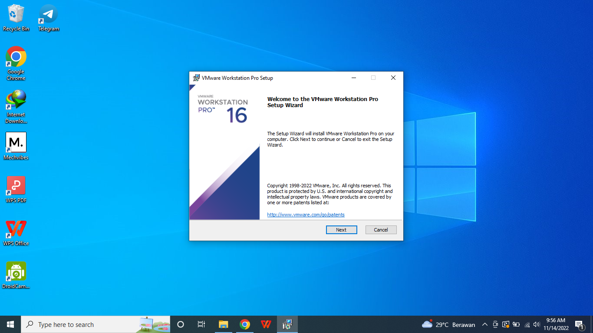

* #### Centang I accept the terms..., lalu Next.

* #### Pilih yang bawah Add VMware Workstation..., lalu Next.

* #### Centang keduanya seperti gambar dibawah ini, lalu Next.

* #### Semisal setelah install ingin memunculkan icon dari VMware bisa centang Desktop, lalu Next

* #### Klik Install.

* #### Proses Installing VMware sedang berjalan.

* #### Semisal mempunyai License, bisa klik License, kalau tidak bisa langsung klik Finish.

* #### Ini tampilan semisal anda ingin memasukkan license key.
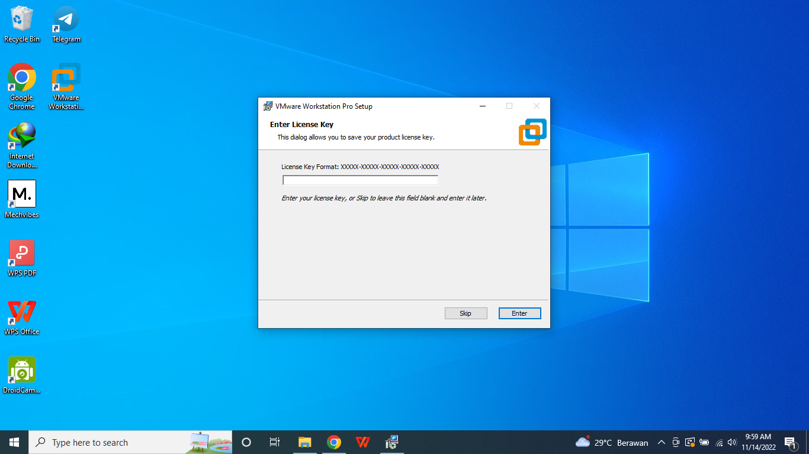

* #### Buka Home di windows lalu ketik VMware Workstation Player, jika muncul berarti proses installasi berjalan dengan baik.
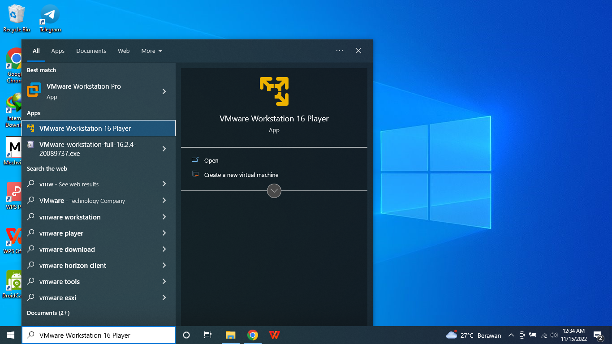

* #### Tampilan setelah dibuka VMware Workstation Player. Pilih Create a New Virtual Machine.
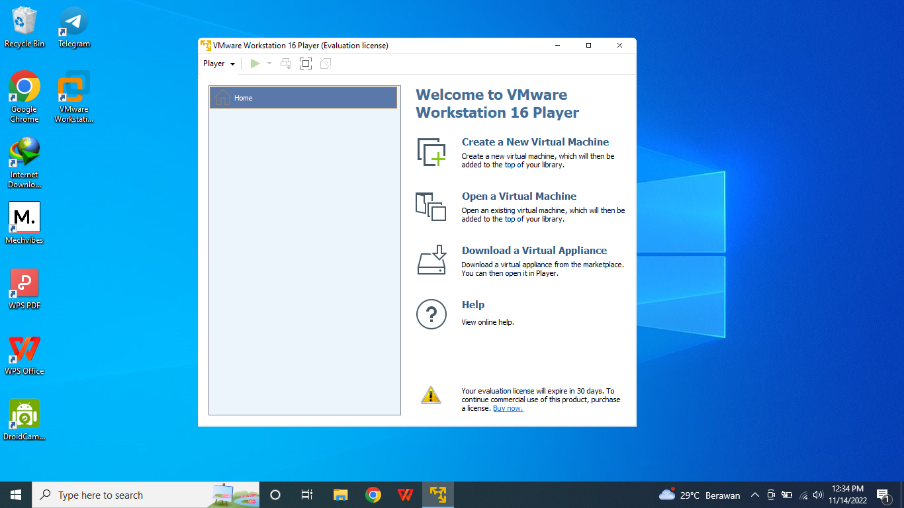

* #### Pilih Browse untuk memilih file iso yang akan digunakan. Lalu Next.
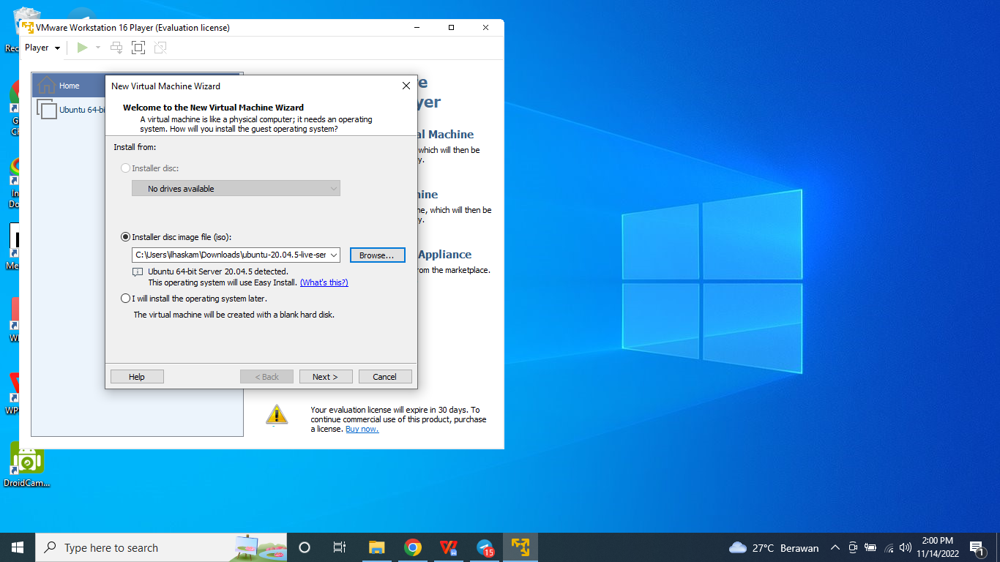

* #### Masukkan Fullname, username, dll. Lalu Next.
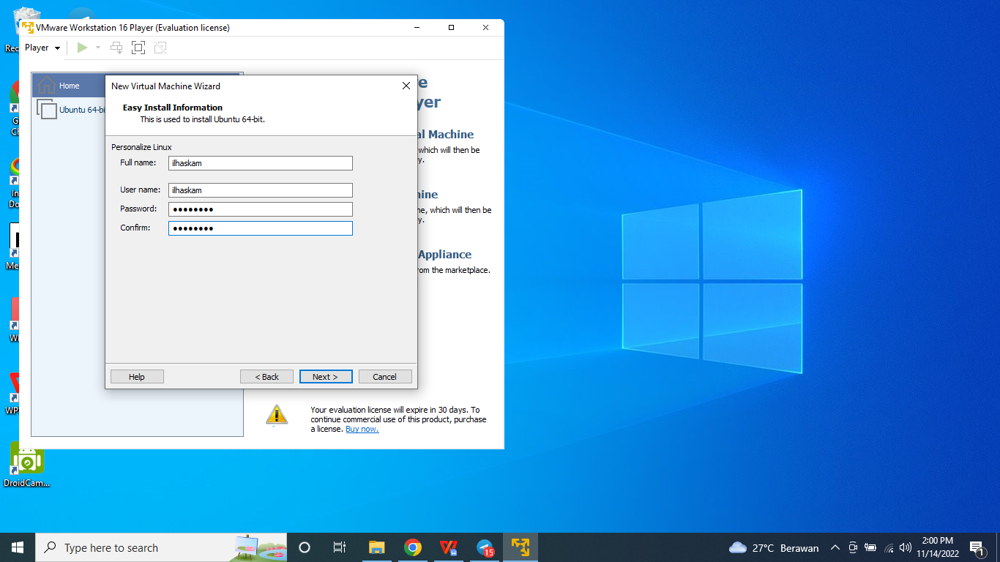

* #### Klik Next.

* #### Maximum disk size isi 20.0. Lalu pilih Split virtual disk intomultiple files. Lalu Next.
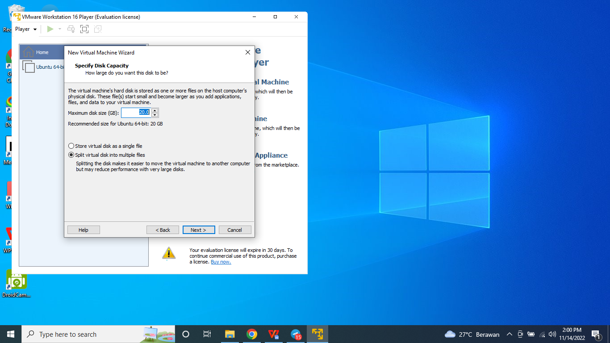

* #### Pilih Customize Hardware.
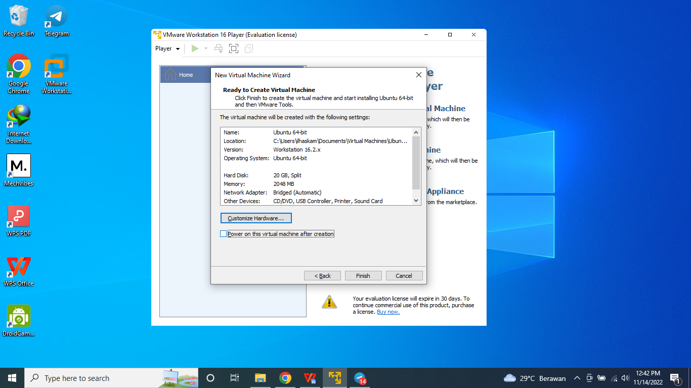

* #### Memory isikan 2GB.
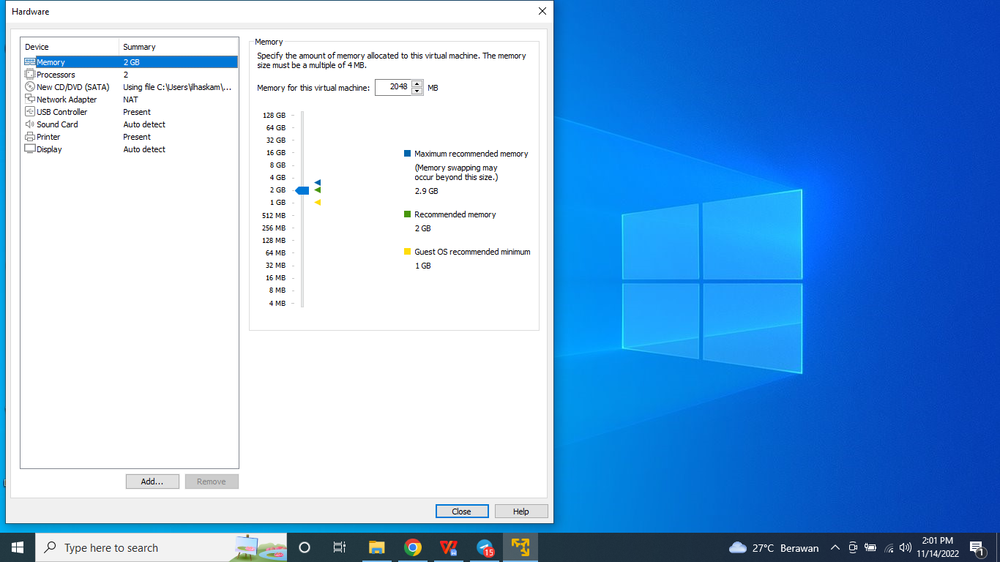

* #### Processors isikan 1 (Optional) diatas 1 juga gpp sesuai kebutuhan masing-masing.

* #### Network Adapter ubah menjadi bridged.
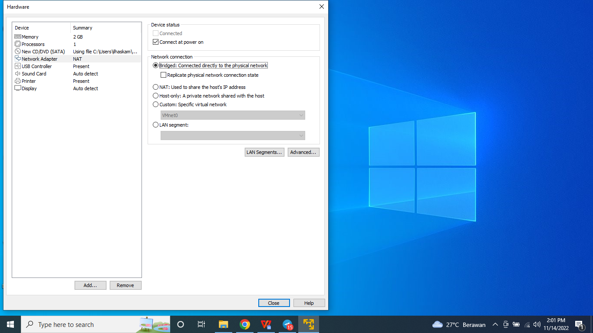

* #### Klik Finish.

* #### Proses Installasi.
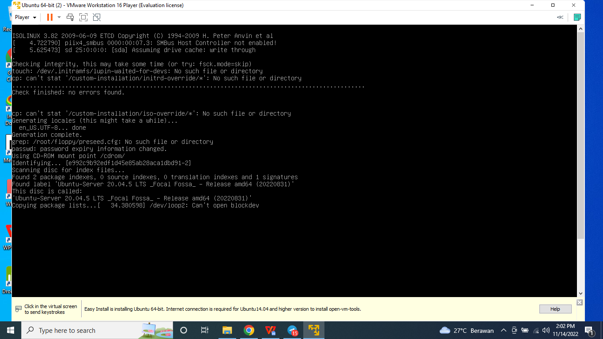
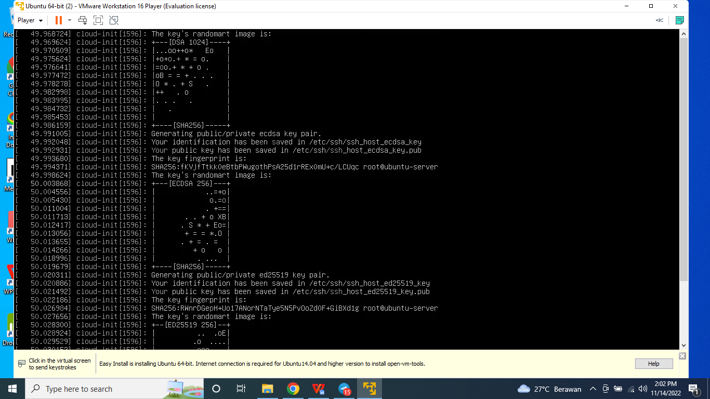
