# Task : Linux Shell & Computer Networking

### 1. Perbedaan antara IP private & public

* #### IP public adalah alamat IP yang digunakan dalam jaringan global Internet. Diberikan oleh penyedia layanan internet (ISP), dimana terdapat informasi sehingga dapat dilacak.

* #### IP private adalah alamat IP yang digunakan dalam jaringan local dan tidak bisa diakses dari jaringan internet secara langsung.

### 2. Perbedaan antara IP dinamis & statis

* #### IP Address Dinamis merupakan pemberian IP secara otomatis dalam sebuah jaringan baik itu bersifat IP publik atau IP private. IP ini akan berubah-ubah setiap waktu.

* #### IP Address Statis merupakan pemberian IP yang tidak akan berubah, harus di konfigurasi manual jika ingin menggunakan IP statis.

### 3. Deploy aplikasi web server apache menggunakan apt package

* #### Pertama install apache web server menggunakan command "sudo apt install apache2".
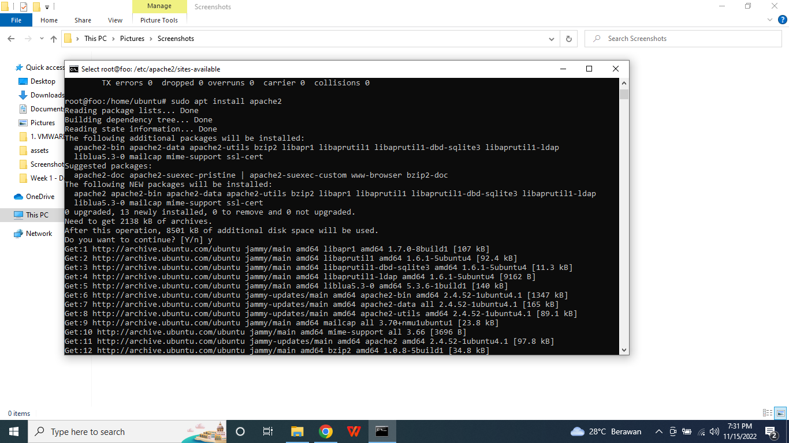

* #### Untuk melihat file konfigurasi dari apache web server masuk ke direktori /etc/apache2/sites-available, Lalu buka menggunakan nano 000-default.conf.
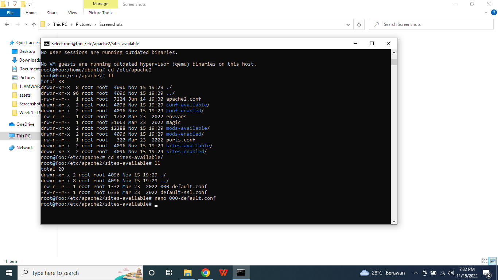

* #### Pada file 000-default.conf berisi konfigurasi dari apache web server.
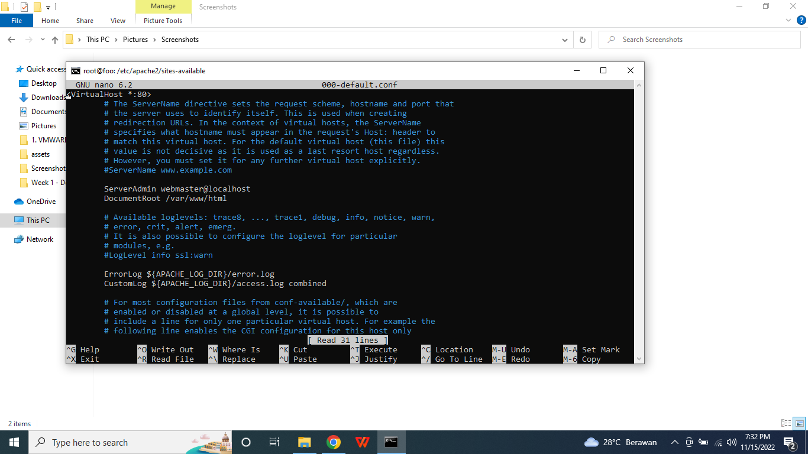

* #### Cek ip dari server di linux menggunakan command ifconfig.
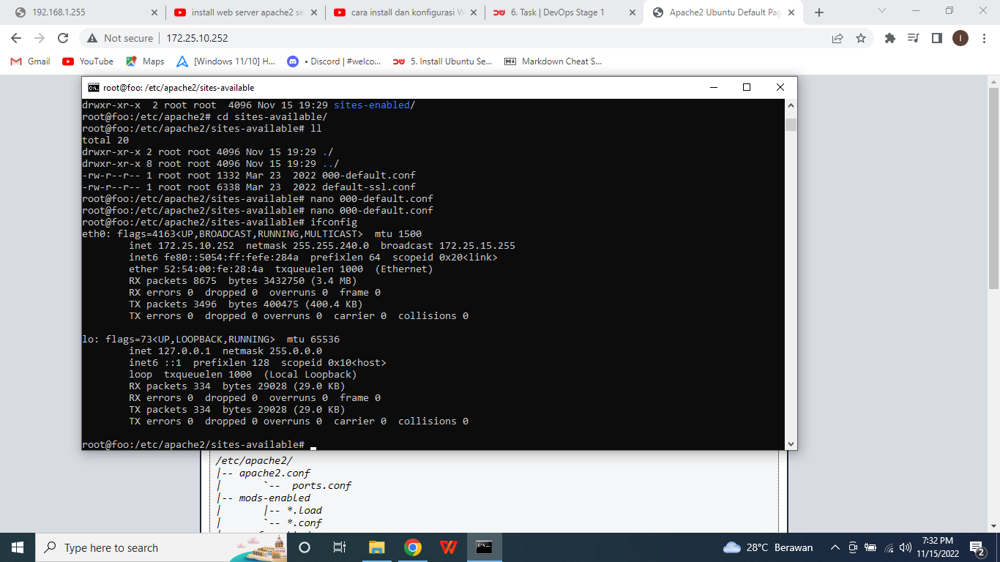

* #### Buka browser dan masukkan ip dari server.

* #### Masuk ke direktori /etc/apache2/sites-available. File default dari apache2 adalah 000-default.conf, tetapi sudah saya disable menggunakan command sudo a2dissite 000-default.conf, lalu saya buat file konfigurasi baru bernama ilham.conf.
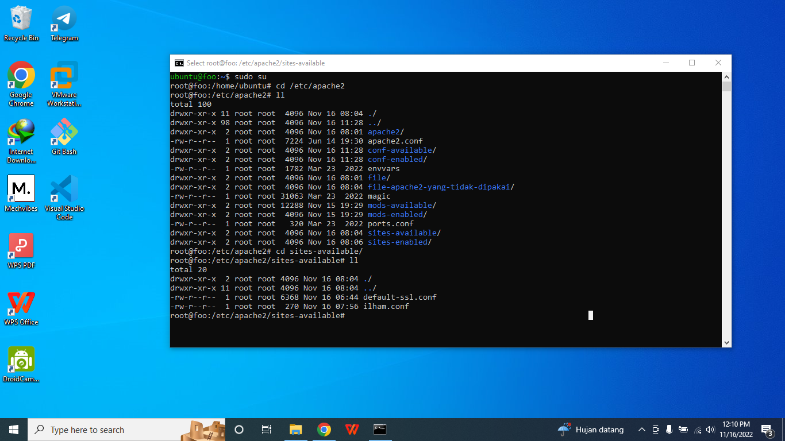

* #### nano ilham.conf, pada file konfigurasi ini sudah saya tambahkan servername sesuai ip dari multipass, documentroot saya masukkan ke /var/www/ilham.

* #### Setelah itu masuk ke direktori sites-enable, bisa dilihat bahwa file dari ilham.conf juga sudah ada di dalam direktori sites-enable, dikarenakan kedua direktori tersebut saling berhubungan.
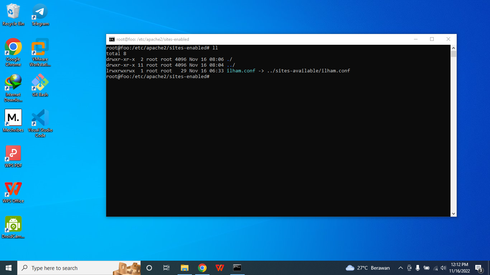

* #### nano ilham.conf, maka isinya akan sama seperti file ilham.conf yang berada di direktori sites-available.
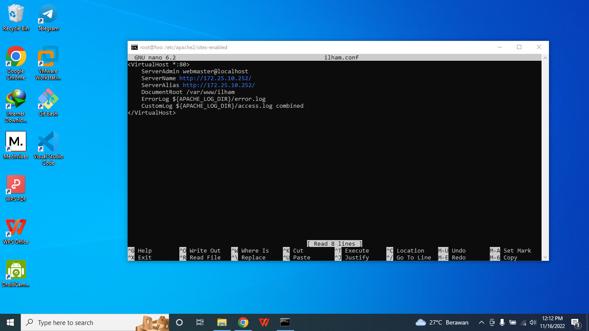

* #### Untuk file konfigurasi website dari apache2 berada dalam direktori /var/www/html, namun sudah saya ubah ke /var/www/ilham. Coba masukkan perintah ll untuk melihat list dari file-file yang berada dalam direktori /var/www/ilham. Untuk file aslinya yaitu di index.html
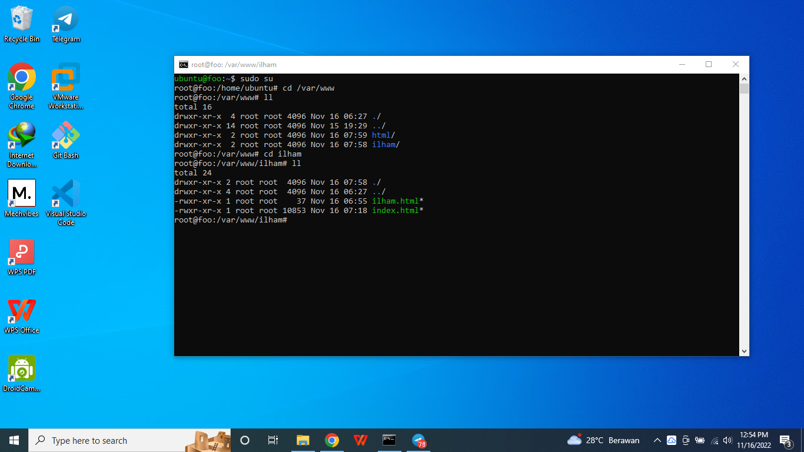

* #### Lalu coba nano index.html, maka akan dimunculkan script code dari apache2.
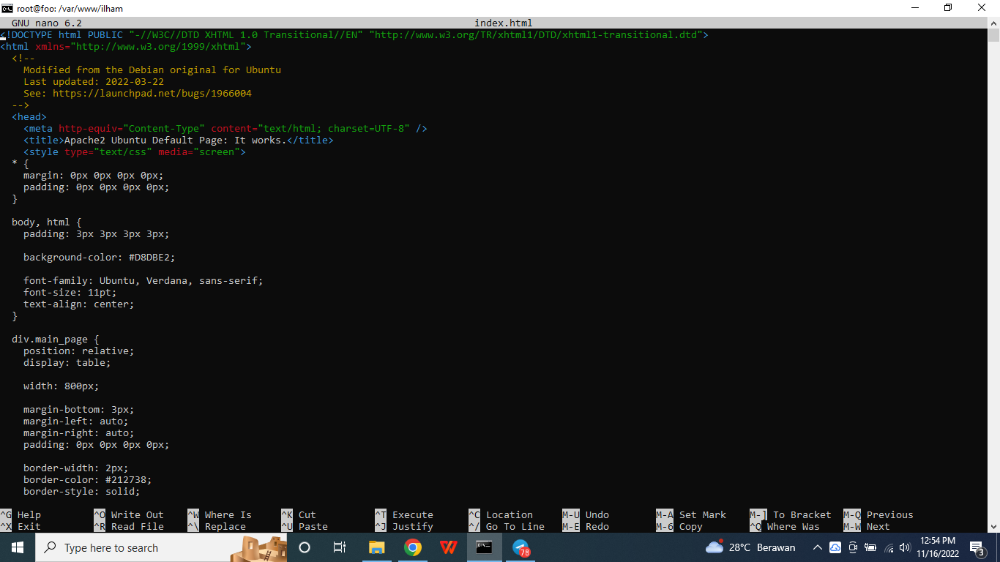

* #### Lalu coba nano ilham.html, maka akan dimunculkan script code dari file custom yang sudah saya buat.
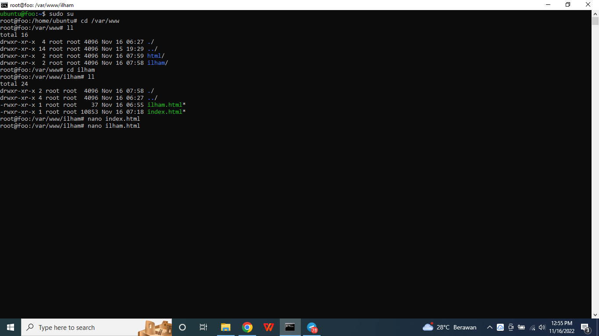

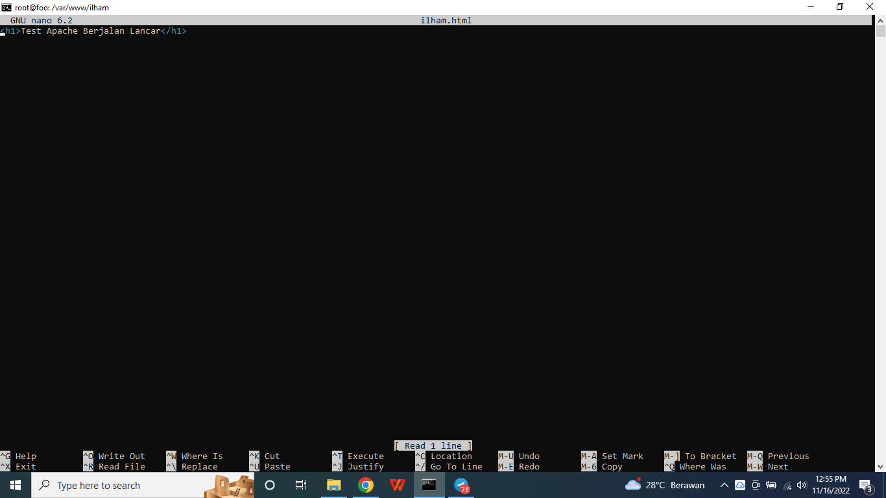

* #### Setelah dicoba dibuka di windows melalui ip dari multipass, maka akan muncul tampilan website dari apache2, namun dari script kodenya ada beberapa yang saya tambahkan, bila diklik Test Link ke page ilham, maka akan di redirect ke halaman ilham.html.
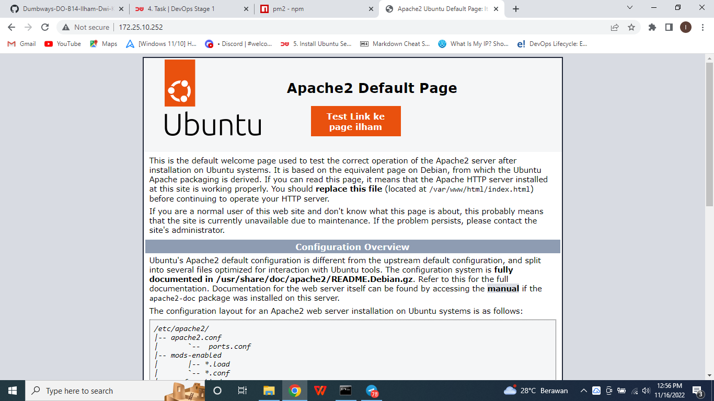

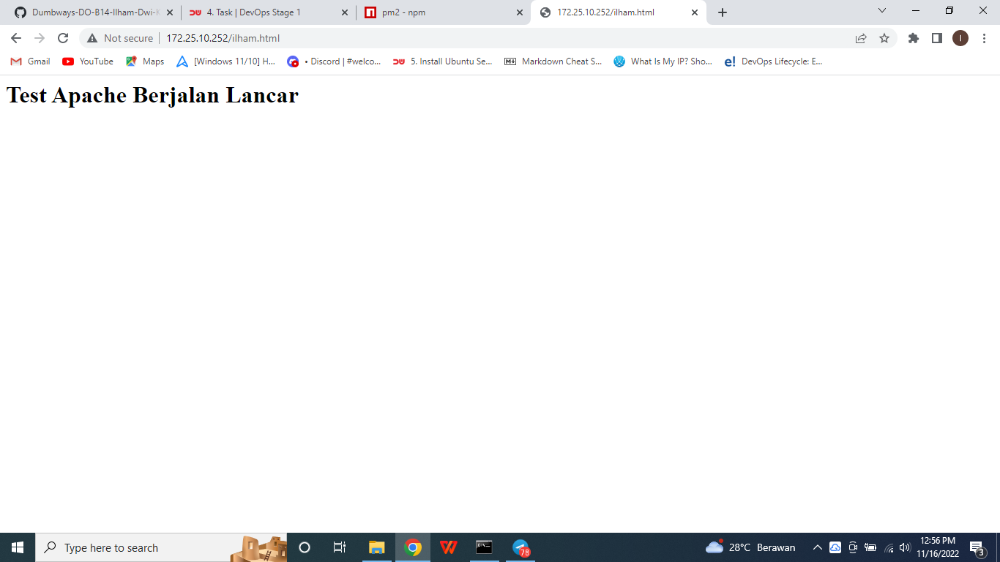

Lebih lengkapnya lihat disini : https://www.digitalocean.com/community/tutorials/how-to-install-the-apache-web-server-on-ubuntu-20-04-id
