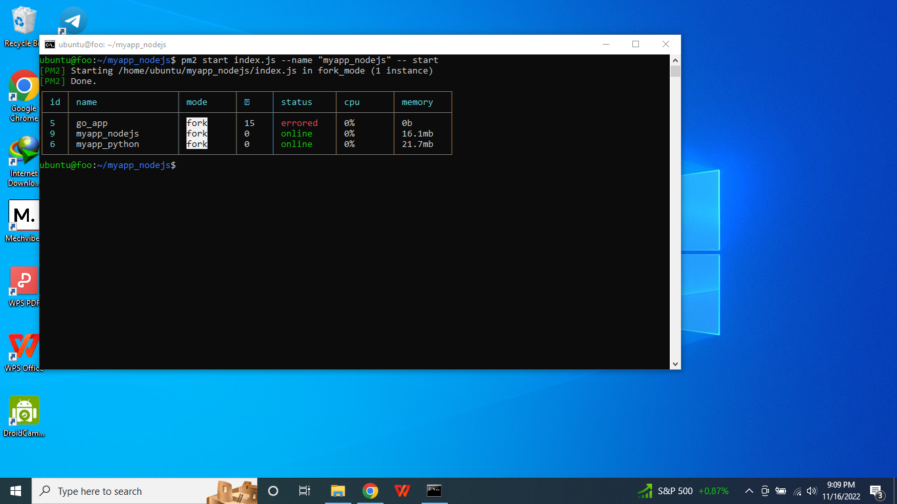

# Task : Application in Server

## 1. Perbandingan antara Monolith & Microservices

### Monolitik merupakan sebuah pendekatan tradisional dalam pembangunan sebuah aplikasi. Aplikasi monolitik terbentuk sebagai satu kesatuan kode yang tidak dapat dipisahkan satu dan lainnya. Salah satu karakter sistem arsitektur monolitik adalah saat pemrogram ingin melakukan perubahan pada sistem monolitik, pemrogram harus mengubah satu kesatuan kode secara menyeluruh dan bersamaan.

### Kelebihan Arsitektur Monolitik

1. #### Kemudahan dalam penerapan.
2. #### Sederhana untuk dikembangkan.
3. #### Debugging dan testing yang lebih mudah.

### Kekurangan Arsitektur Monolitik

1. #### Sulit memahami kode pemrograman saat pemeliharaan.
2. #### Sulit melakukan perubahan.
3. #### Sulit mengembangkan aplikasi.
4. #### Sulit mengadopsi teknologi baru.

### Jika monolitik adalah sebuah arsitektur aplikasi secara kesatuan atau tunggal, maka microservices adalah sebaliknya. Microservices terbagi menjadi unit pecahan yang lebih kecil dan spesifik. Setiap unitnya terpisah dan memiliki sistem beserta database sendiri untuk beroperasi dan menggunakan mekanisme API untuk terhubung dengan unit lainnya.

### Kelebihan Microservices

1. #### Unit yang mandiri.
2. #### Lebih mudah dipahami.
3. #### Mudah mengembangkan aplikasi.
4. #### Bebas adopsi teknologi baru.

### Kekurangan Microservices

1. #### Tingkat kerumitan yang berbeda.
2. #### Testing yang rumit.

### Monolitik :

* #### Memiliki tim yang kecil
* #### Sistem aplikasinya sederhana
* #### Belum memiliki pengalaman dan keahlian mengembangkan sistem microservices
* #### Meluncurkan aplikasi lebih cepat

### Microservices :

* #### Memiliki pengalaman dan keahlian mengembangkan sistem microservices
* #### Aplikasi lebih rumit dan bertujuan untuk perluasan bisnis
* #### Memiliki tim programmer yang memadai

Lebih lengkapnya lihat disini : https://www.webarq.com/id/blog/microservices-vs-monolitik-mana-yang-lebih-baik-untuk-arsitektur-teknologi-bisnis-masa-kini

## 2. Deploy Aplikasi wayshub-frontend (NodeJS)

* #### Pertama clone terlebih dahulu aplikasi yang ingin kita install.

* #### Setelah clone dari github pastikan bahwa file atau folder yang sudah kita clone berada dalam laptop atau pc kita, pada gambar di bawah sudah ada folder yang bernama wayshub-frontend.

* #### Lalu jangan lupa untuk berpindah ke direktori wayshub-frontend.

* #### Dikarenakan dalam proses clone, dependencies dari aplikasi masih belum terinstall, maka untuk aplikasi node js jalankan npm install, dengan command ini akan mengunduh semua dependencies yang diperlukan untuk menjalankan aplikasi tersebut sesuai apa yang tercantum di dalam package.json aplikasi tersebut.

* #### Setelah proses npm install coba lihat list dari folder saat ini dengan perintah ll atau ls -la, bisa dilihat pada gambar dibawah ada folder bernama node_modules yang sebelumnya tidak ada, tetapi setelah memasukkan perintah npm install maka folder tersebut akan terbuat dikarenakan semua dependencies yang diperlukan aplikasi tersebut berada dalam folder tersebut.

* #### Untuk menjalankan aplikasi pada node js, ketikkan perintah npm start.

* #### Setelah npm start maka akan muncul tulisan starting development program dan selanjutnya akan muncul di port berapa aplikasi yang kita jalankan berjalan, namun pada case ini port tidak muncul dikarenakan pada aplikasi ini masih ada sejumlah attention bahwa codingan atau script code dari aplikasi ini masih belum clean code atau masih ada yang perlu diperbaiki dalam script codenya, namun ini bukan error atau bug.

* #### Setelah berjalan jika kalian ingin melihat di port yang berjalan di laptop atau PC kalian bisa dengan command netstat -nlptu untuk melihat port berapa saja yang berjalan di laptop atau PC, cari saja port dengan nama program name yang sama dengan aplikasi yang sedang kalian jalankan pada saat ini.

## 3. Deploy Golang & Python dengan menampilkan nama masing-masing

* #### Install pm2 dengan command npm install -g pm2.

* #### Untuk mengecek apakah sudah terinstall pm2, coba masukkan perintah pm2 list, ini akan menampilkan list program yang sudah dijalankan dengan pm2.

* #### Masuk ke direktori dari aplikasi yang ingin dijalankan, lalu cek list file dan folder yang berada dalam aplikasi tersebut menggunakan command ll.

* #### Untuk menjalankan aplikasi golang di pm2, pastikan sudah menjalankan build pada index.go dengan command "go build index.go", setelah membuild index.go maka akan terbuat file atau folder bernama index yang berisi data hasil build dari index.go, lalu coba jalankan ./index untuk mengetahui apakah build dari aplikasi golang sudah berjalan lancar, dalam case ini akan muncul tulisan Ilham Dwi Kurniawan setelah menjalankan ./index dikarenakan di dalam aplikasi golang saya hanya menampilkan nama saya di script code golangnya. Lalu untuk menjalankan aplikasi golang di pm2 bisa menggunakan command pm2 start ./index --name <nama_aplikasi> dan akan ditampilkan list dari aplikasi yang berjalan di pm2.

* #### Untuk menjalankan aplikasi python di pm2, masuk ke dalam direktori aplikasi python terlebih dahulu, lalu masukkan perintah pm2 start index.py --name <nama_aplikasi> --interpreter python3, nah disini untuk menjalankan aplikasi python di pm2 dibutuhkan interpreter dari python untuk berjalan di pm2.

* #### Lalu cek di port berapa aplikasi python berjalan menggunakan netstat -nlptu, setelah itu buka terminal yang lain untuk menjalankan localtunnel, untuk menjalankan localtunnel bisa menggunakan command lt --port <port_yang_berjalan_diaplikasi_python>, setelah itu akan muncul semacam link untuk membuka aplikasi tersebut. 

* #### Lalu copy paste ke browser kalian link tersebut. Jika muncul tulisan Continue, maka klik saja tombol Continue tersebut.

* #### Untuk menjalankan aplikasi nodejs di pm2 kurang lebih sama seperti aplikasi python dan golang dengan menjalankan perintah pm2 start index.js --name <nama_aplikasi> -- start. lalu cek dimana port berjalan.

* #### Lalu cek dimana port berjalan, kemudian akses menggunakan ip dari multipass ditambah port tersebut berjalan.

* #### Ini adalah proses deploy aplikasi wayshub-frontend di pm2.

## 4. Jalankan localtunnel untuk aplikasi no 1

* #### Jalankan perintah sudo apt install curl.

* #### Lalu jalankan perintah seperti pada gambar di bawah ini.

* #### Lalu install nvm 14.

* #### Cek versi node js dan npm.

* #### Lalu install localtunnel dengan perintah npm install -g localtunnel, -g artinya kita menginstall secara global dan akan bisa diakses di dalam direktori manapun di dalam laptop atau pc kita.

* #### Jangan lupa untuk selalu menjalankan npm install terlebih dahulu setelah meng-clone dari github lalu npm start. Agar aplikasi kita bisa diakses secara publik melalui internet dengan menggunakan localtunnel, jalankan terlebih dahulu aplikasi kita menggunakan npm start, lalu buka terminal baru dan masukkan perintah lt --port <port_yang_berjalan_diaplikasi_tersebut>.

* #### Setelah menjalankan perintah lt --port <port_yang_berjalan_diaplikasi_tersebut> maka akan muncul link untuk mengakses aplikasi tersebut lewat internet. Copy paste link tersebut ke dalam browser.

* #### Lalu Click to Continue.

* #### Maka aplikasi tersebut sudah bisa diakses melalui internet.

## Challenge
### Gunakan PM2

### Repository : https://github.com/dumbwaysdev/wayshub-frontend