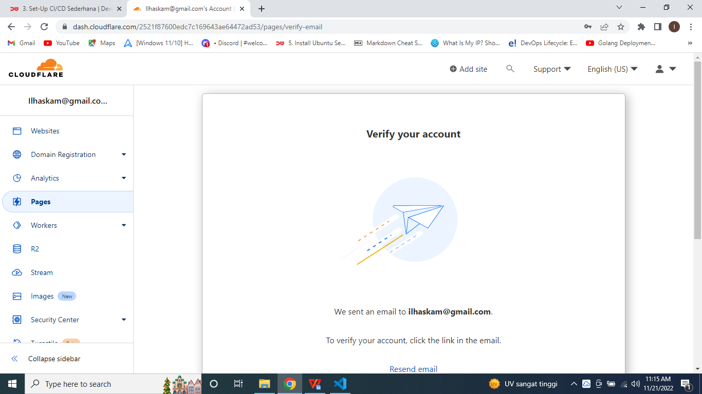

# Task : CI/CD with Cloudflare Pages

## 1. Definisikan CI/CD sesuai dengan bahasa kalian

* #### CI/CD adalah rangkaian praktik pengembangan perangkat lunak secara otomatis yang memungkinkan developer untuk menerapkan perubahan yang lebih sering pada perangkat lunak yang dikembangkan.

* #### CI adalah praktik pengembangan perangkat lunak yang dilakukan developer dengan menggabungkan serangkaian kode yang terintegrasi ke dalam sebuah repository secara berkelanjutan. 

* #### Pada tahap Continuous Delivery, kode-kode terintegrasi yang telah dibuat dari tahap CI akan secara otomatis dikirim ke suatu lingkungan untuk melakukan uji kelayakan pada software tersebut. Apabila hasil pengujian otomatis tersebut telah berhasil, maka perangkat lunak tersebut telah layak untuk diproduksi. 

* #### Setelah melalui proses uji kelayakan pada bagian Continuous Delivery, proses selanjutnya dari pengembangan perangkat lunak menggunakan CI/CD adalah Continuous Deployment. Pada tahap ini perangkat lunak yang telah diperbaharui akan disebarkan ke tahap produksi. 

## 2. Fork repository Dumbflix

* #### Pertama masuk ke github dari repository yang ingin di fork. Pada kasus ini saya akan fork dari repository berikut : https://github.com/dumbwaysdev/dumbflix-frontend.

* #### Selanjutnya klik fork yang ada di pojok kanan atas bagian github. Lalu pilih "Create a new fork".

* #### Selanjutnya akan muncul halaman github seperti gambar di bawah, masukkan nama repository sesuai keinginan kalian. Lalu klik "Create fork".

* #### Maka akan secara otomatis repository yang kalian fork menjadi repository milik kalian. Coba cek di repository akun github kalian.

* #### Fork repository dari dumbflix-frontend telah berhasil.

## 3. Deploy melalui Cloudflare Pages

* #### Pastikan kalian sudah melakukan register ke https://cloudflare.com, Jika kalian belum mempunyai akun Cloudflare kalian bisa melakukan registrasi terlebih dahulu.

* #### Jika sudah melakukan registrasi, akan muncul halaman awal cloudflare seperti gambar di bawah.

* #### Masuk ke "Pages" lalu verifikasi akun gmail kalian.

* #### Selanjutnya klik "Connect to git", Supaya repository di akun github kalian terdeteksi ke Cloudflare Pages.

* #### Lalu akan muncul halaman seperti gambar di bawah. klik "Install and Authorize".

* #### Akun github akan terhubung dengan akun cloudflare kalian.

* #### Pilih repository yang ingin kalian deploy.

* #### Lalu klik "Begin setup".

* #### Isi nama projek dan branch yang kalian gunakan.

* #### Dikarenakan saya akan men-deploy aplikasi dari frontend, maka di framework preset saya pilih "CreateReact App", Build command dan build output directory tidak perlu diubah pada kasus ini.

* #### Klik "Save and Deploy".

* #### Maka cloudflare akan secara otomatis men-deploy aplikasi kalian. Pada gambar di bawah adalah proses deploy aplikasi.

* #### Jika pada kolom Status Success, maka aplikasi kalian sudah ter-deploy.

* #### Lalu klik di halaman "Pages". Lalu pada kolom Domain adalah url dari aplikasi yang sudah kalian deploy. Copy paste link tersebut lalu buka di browser kalian.

* #### Jika berhasil maka aplikasi kalian sudah ter-deploy dan bisa diakses di internet.

* #### Selanjutnya coba ubah script code yang ada di dalam folder public/index.html. COba ubah Fadil Darma Putera Z menjadi nama kalian masing-masing.

* #### Lalu simpan perubahan dengan klik "Commit changes".

* #### Maka pada akun cloudflare akan secara otomatis men-deploy ulang aplikasi yang sudah kita deploy sebelumnya. Dikarenakan cloudflare sudah menggunakan konsep CI/CD, sehingga jika terjadi perubahan atau update dari repository github yang sudah kalian deploy di cloudflare akan otomatis men-deploy ulang.

* #### Jika Status sudah berubah dari in progress menjadi success, maka aplikasi kalian sudah ter-update sesuai perubahan yang terjadi di repository kalian.

* #### Maka bisa dilihat title yang awalnya bernama Fadil Darma Putera Z berubah menjadi Ilham Dwi Kurniawan.

### Challenge
### Deploy 2 branch yang berbeda

* #### Untuk men-deploy dengan 2 branch yang berbeda. Pertama buat dulu branch baru di akun github kalian. Untuk membuat branch baru klik master lalu klik "view all branch".

* #### Pilih new branch.

* #### Masukkan nama branch yang kalian inginkan. Lalu klik Create branch.

* #### Maka akan ada 2 branch berbeda di repository kalian.

* #### Pada akun cloudflare akan otomatis menjalankan perubahan di aplikasi kalian. Bisa dilihat bahwa branch yang sudah ditambahkan di github, maka di cloudflare juga otomatis berubah.

* #### Lalu lihat di All deployment ada Source dengan nama staging, lalu buka link URL yang ada di kolom Deployment.

* #### Maka akan muncul hasil deploy menggunakan branch staging.

* #### Untuk melihat perbedaan dari hasil deploy menggunakan 2 branch yang berbeda. Saya ubah file di index.html. Title saya ubah menjadi Dumbflix - master - Ilham Dwi Kurniawan pada branch master.

* #### Lalu buka perubahan apa yang terjadi di branch master.

* #### Maka akan terubah titlenya menjadi Dumbflix - master - Ilham Dwi Kurniawan.

* #### Saya ubah file di index.html. Title saya ubah menjadi Dumbflix - staging - Ilham Dwi Kurniawan pada branch staging.

* #### Maka akan otomatis ter-update.

* #### Lalu buka link URL dari branch staging.

* #### Domain dari branch master.

* #### Domain dari branch staging.

### Repo Dumbflix
### https://github.com/dumbwaysdev/dumbflix-frontend