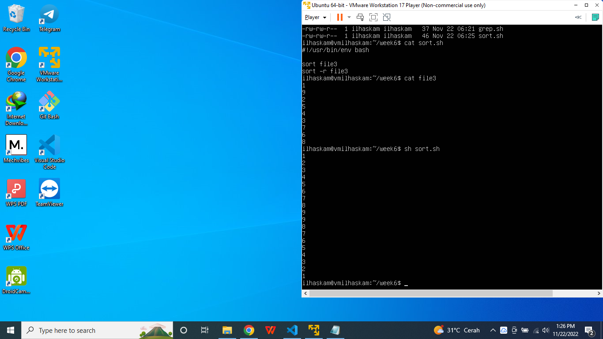

# Task : Manage Server with Terminal

## 1. Perbedaan antara Shell dan BASH

* #### Shell adalah antarmuka teks, dimanifestasikan dalam bentuk Terminal.

* #### Bash kepanjangan dari Bourne Again Shell. Berfungsi sebagai penerjemah antara user dan sistem operasi. Bash merupakan shell yang paling umum digunakan pengguna Linux. Bisa dibilang bash ini adalah versi lebih barunya dari shell.

## 2. BASH script untuk update dan upgrade server

* #### Pertama lihat list di dalam ubuntu kita.

* #### Ketik nano (nama_file) pada kasus saya ini saya buat nama file update_upgrade_server.sh. Lalu masukkan perintah untuk update dan upgrade server di ubuntu.

* #### Jika sudah tersimpan pada list direktori akan terbuat file update_upgrade_server.sh.

* #### Untuk menjalankan bash script di ubuntu server gunakan perintah sh nama_file (update_upgrade_server.sh). Maka proses akan dilakukan secara otomatis oleh server kita.

## 3. BASH script untuk memberi akses ke port 22,80,443

* #### Untuk memberikan akses port kita harus mengecek dahulu apakah settingan firewall diubuntu server kita sudah active atau belum dengan perintah sudo ufw status. Maka akan muncul tulisan active atau inactive.

* #### Buat file untuk menjalankan bash script. Pada kasus ini saya beri nama allow_22_80_443.sh.

* #### Masukkan perintah sudo ufw allow (port_yang_di_allow) pada file allow_22_80_443.sh. sudo ufw allowa bertujuan untuk memberikan akses untuk port 22, 80, dan 443 untuk bisa diakses dari luar server ubuntu kita.

* #### Untuk memastikan bahwa perintah yang kita jalankan nantinya bisa berjalan dengan lancar. Coba cek ulang perintah yang kita masukkan di file allow_22_80_443.sh. Dengan perintah cat allow_22_80_443.sh.

* #### Pertama coba terlebih dahulu untuk ssh ke server ubuntu kita melalui cmd. Maka akan muncul pesan error pada saat kita mau akses melalui ssh, dikarenakan pada server ubuntu kita belum memberikan akses port 22 untuk diakses melalui luar server dari ubuntu kita.

* #### Untuk menkalankan perintah bash script cukup dengan sh nama_file (allow_22_80_443.sh). Maka akan muncul tulisan "Rule added" yang artinya memberikan akses port kita untuk diakses dari luar server ubuntu sudah berhasil.

* #### Untuk mengeceknya apakah sudah berhasil atau belum, bisa kita coba untuk ssh di ubuntu server kita. Jika sudah berhasil untuk mengakses server ubuntu melalui ssh. Berarti akses port dari luar server ubuntu sudah berhasil.

## 4. Tugas text manipulation

### - contoh penggunaan cat, grep, echo & sort

* #### Perintah cat nama_file berguna untuk melihat isi dari suatu file. 

* #### Perintah cat juga bisa untuk membuat suatu file baru serta memasukkan teks kedalamnya. Dengan perintah cat > nama_file, lalu isikan teks, jika sudah tekan enter lalu ctrl + c.

* #### Kita juga bisa menggabungkan dua buah file ke dalam satu file dengan perintah cat. COntoh penggunaannya seperti gambar di bawah.

* #### Grep merupakan perintah untuk melakukan pencarian sebuah text dalam sebuah file yang telah dibuat. Perintah grep Halo file2 akan mencari text Halo didalam file2.

* #### Jika pada penggunaan perintah grep ada penambahan -c (Count) berarti kita ingin menghitung berapa jumlah kata tersebut didalam suatu file. Contoh perintah grep -c Bootcamp file2.

* #### Perintah grep semuanya *, bermaksud untuk mencari teks semuanya di dalam file yang ada di dalam direktori saat kita menjalankan perintah tersebut.

* #### Perintah echo digunakan untuk mencetak string.

* #### Perintah echo "menyisipkan kata di file1" >> file1. Perintah tersebut artinya kita akan mencetak teks atau kata "menyisipkan kata di file1" di dalam file1.

* #### Perintah echo "ganti semua kata di file1" > file1. Perintah tersebut artinya kita akan me-replace semua data di dalam file1 dan menggantinya dengan teks ganti semua kata di file1.

* #### Perintah sort digunakan untuk mengurutkan data didalam suatu file secara ascending atau berurutan dari nilai terkecil ke yang terbesar.

* #### Perintah sort dengan menambahkan -r (reverse) digunakan untuk mengurutkan data didalam suatu file secara descending atau berurutan dari nilai terbesar ke yang terkecil.

### - mengganti text 'Dumbways' ke 'Bootcamp'

* #### Perintah sed digunakan untuk memanipulasi teks. Contoh penggunaan sed -i 's/Dumbways/Bootcamp/g' file7. Perintah tersebut artinya kita akan mengubah teks Dumbways menjadi Bootcamp pada file7 tanpa membuka teks editor seperti nano.

## 5. contoh penggunaan aplikasi monitoring

* #### Ada beberapa tools untuk me-monitoring server ubuntu kita. Yaitu menggunakan htop dan nmon. Pertama saya akan mendemokan me-monitoring menggunakan tools htop. Install htop terlebih dahulu di server ubuntu kita.

* #### Untuk menjalankan aplikasi htop, cukup dengan perintah htop maka aplikasi htop akan berjalan di server kita.

* #### Ini adalah tampilan monitoring dari htop. Bisa dilihat kita bisa melihat berbagai informasi yang tersedia didalam aplikasi htop untuk me-monitoring server ubuntu kita. 

- #### CPU : akan memberikan informasi mengenai berapa persen (%) jumlah CPU yang dipakai dalam server ubuntu kita.
- #### Mem : akan memberikan informasi mengenai berapa jumlah Memory yang terpakai dalam server ubuntu kita.
- #### Swp : akan memberikan informasi mengenai cadangan Memory yang terpakai dalam server ubuntu kita.
- #### Tasks : akan memberikan informasi mengenai jumlah aplikasi yang berjalan dalam server ubuntu kita.
- #### Load average : akan memberikan informasi mengenai rata-rata aplikasi yang berjalan dalam server ubuntu kita.
- #### Uptime : akan memberikan informasi mengenai berapa lama server ubuntu kita hidup.
- #### PID : proses id dari proses yang berjalan di server ubuntu kita.
- #### User : akan memberikan informasi mengenai user yang menjalankan aplikasi yang berjalan di server ubuntu kita.
- #### VIRT : akan memberikan informasi mengenai jumlah memory yang terpakai di server ubuntu kita.
- #### Command : akan memberikan informasi mengenai perintah yang sedang dijalankan.

* #### Selanjutnya saya akan mendemokan monitoring menggunakan aplikasi nmon. Pertama install terlebih dahulu aplikasi nmon.

* #### Untuk menjalankan aplikasi nmon cukup dengan perintah nmon. Maka aplikasi nmon akan terbuka di terminal.

* #### Bisa dilihat bahwa kita bisa melihat atau me-monitoring beberapa proses seperti CPU, Memory, Disk, Resource, Kernel, dll. Untuk melihat proses yang ingin dimonitoring bisa melihat di "use this keys ...".

* #### Klik c pada keyboard untuk melihat proses dari CPU.

* #### Klik m pada keyboard untuk melihat proses dari Memory dan Swap.

* #### Klik d pada keyboard untuk melihat proses dari Disk.

* #### Klik n pada keyboard untuk melihat proses dari Network.

* #### Dengan mengeklik c, m, n, dan d pada keyboard kita bisa melihat dari proses CPU, Memory, Disk, dan Network secara bersamaan.

## Challenge

### - Tugas no. 4 dibuat dalam bentuk script BASH

* #### Bash scripting adalah pemrograman kumpulan perintah menggunakan script yang ditulis ke dalam bash shell, sehingga nantinya dapat dieksekusi oleh sistem operasi. Pada penjelasan ini bisa dilihat pada tugas 4.

### - Buat script instalasi node version manager menggunakan BASH

* #### Pertama buat file bernama installasi_nvm.sh. Masukkan perintah untuk menjalankan installasi nvm di dalam file installasi_nvm.sh.

* #### Cek terlebih dahulu apakah perintah kita sudah benar atau masih ada yang salah.

* #### Jika dirasa perintah yang sudah kita masukkan ke dalam file installasi_nvm.sh sudah benar, maka jalankan atau eksekusi file installasi_nvm.sh. sh installasi_nvm.sh. Maka server akan menjalankan secara otomatis saat kita meng-ekseskusi file installasi_nvm.sh.

* #### Lalu coba cek versi node dan npm.
