# Task : Web Server & Load Balancing

## 1. Definisi Web Server

* #### Web server adalah sebuah software (perangkat lunak) yang memberikan layanan berupa data. Berfungsi untuk menerima permintaan HTTP atau HTTPS dari klien atau kita kenal dengan web browser (Chrome, Firefox). Selanjutnya ia akan mengirimkan respon atas permintaan tersebut kepada client dalam bentuk halaman web.


## 2. Jalankan 2 VM
  ### - VM 1 = server
  ### - VM 2 = nginx


## 3. VM1 : jalankan aplikasi dumbflix-frontend - gunakan PM2

* #### Pertama jalankan aplikasi wayshub pada sisi server menggunakan pm2. Jika pada pm2 list status = online, maka aplikasi sudah berjalan di pm2.
``` 
pm2 start npm --name "wayshub-frontend" -- start
```


* #### Coba akses aplikasi wayshub menggunakan ip dari sisi server. Jika berhasil maka aplikasi wayshub akan tampil.
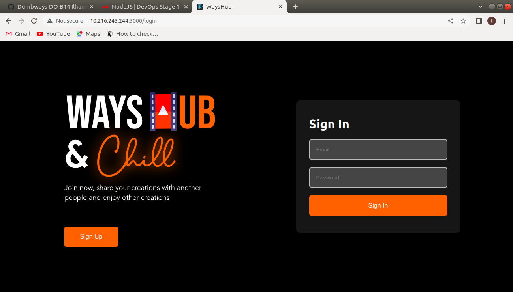


## 4. VM2 :

### - jalankan nginx 

* #### Selanjutnya install web server nginx pada sisi nginx.
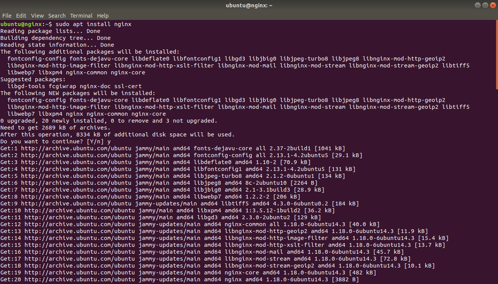


### - buat konfigurasi reverse proxy dengan domain (gunakan nama kalian) mengarah ke app di VM1

* #### Masuk ke direktori /etc/nginx. Pada direktori ini berisi file-file konfigurasi dari web server nginx.
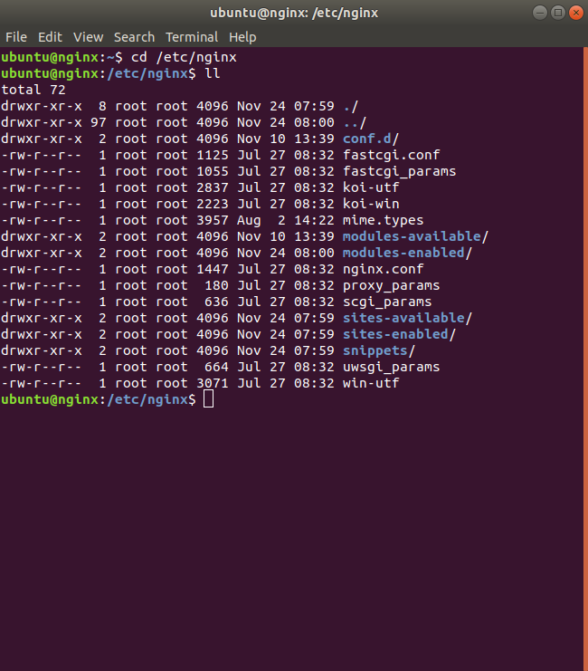

* #### Buat direktori untuk menyimpan file konfigurasi untuk membuat reverse proxy di dalam direktori /etc/nginx.
``` 
sudo mkdir dumbways
```
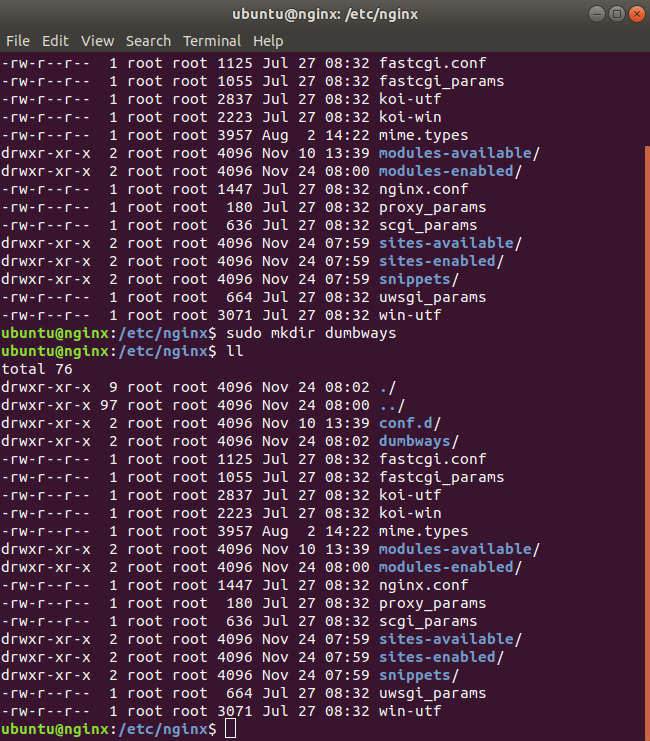

* #### Buat file konfigurasi untuk membuat reverse proxy di dalam direktori /etc/nginx/dumbways.
``` 
sudo nano my.domain.conf
```
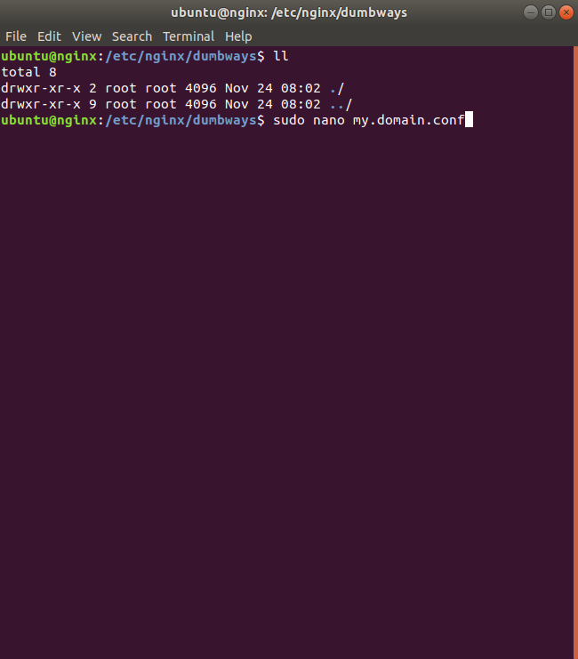

* #### Lalu konfigurasi untuk membuat reverse proxy pada aplikasi wayshub. Tambahkan konfigurasi berikut di dalam file my.domain.conf
``` 
server { 
    server_name domain.com; 
    
    location / { 
             proxy_pass http://ip_server:3000;
    }
}
```
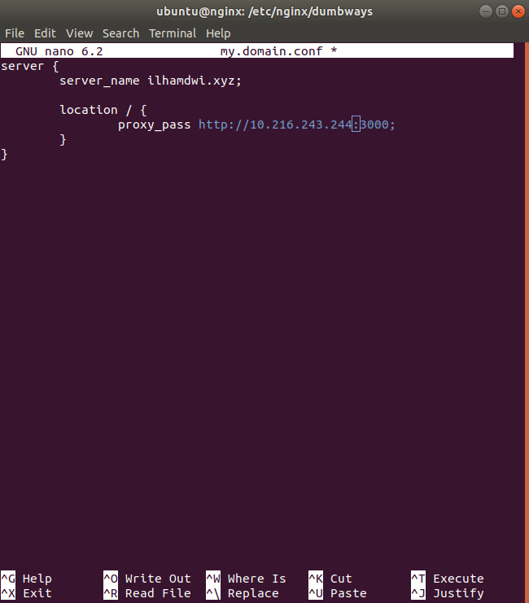

* #### Selanjutnya tambahkan ip dari nginx beserta domain yang sudah dibuat sebelumnya ke dalam file /etc/hosts di ubuntu. 
``` 
sudo nano /etc/hosts

lalu tambahkan

(ip_dari_nginx) (domain) 
```
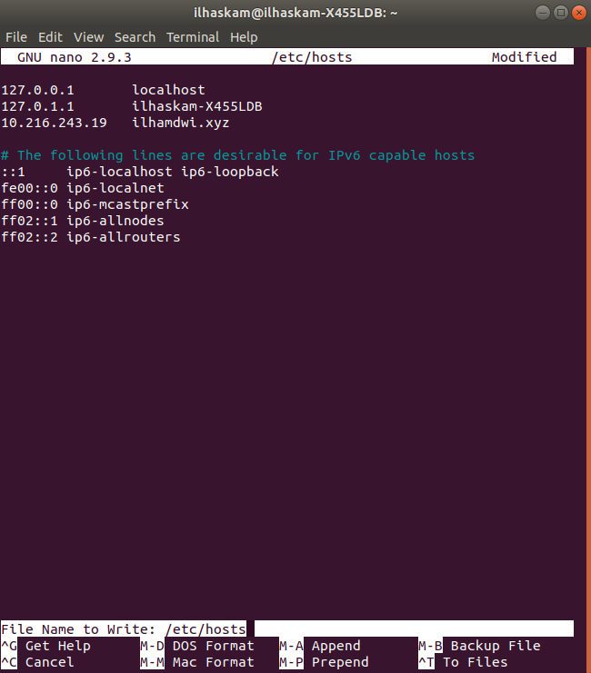

* #### Lalu coba tes domain ilhamdwi.xyz.
``` 
curl ilhamdwi.xyz
```
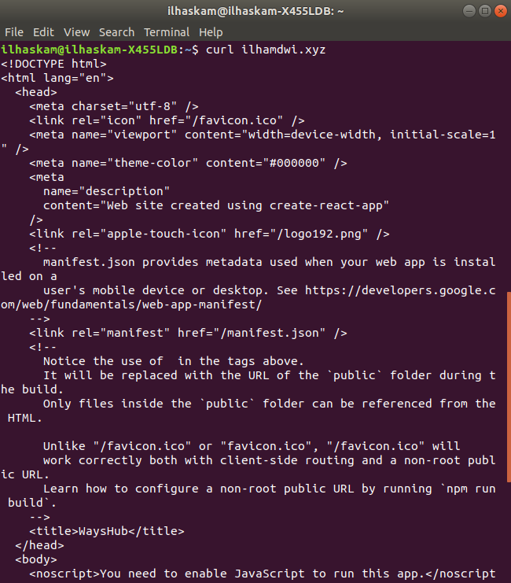

* #### Lalu akses di web browser.
``` 
curl ilhamdwi.xyz
```
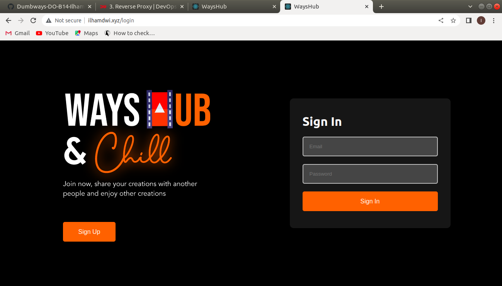

* #### Coba matikan aplikasi wayshub di pm2 pada sisi server.
``` 
pm2 stop (id)
```
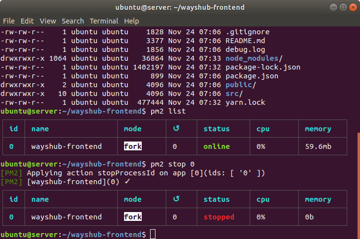

* #### Lalu coba akses kembali pada web browser. Maka akan muncul Gateway time out dikarenakan aplikasi wayshub di pm2 di stop.
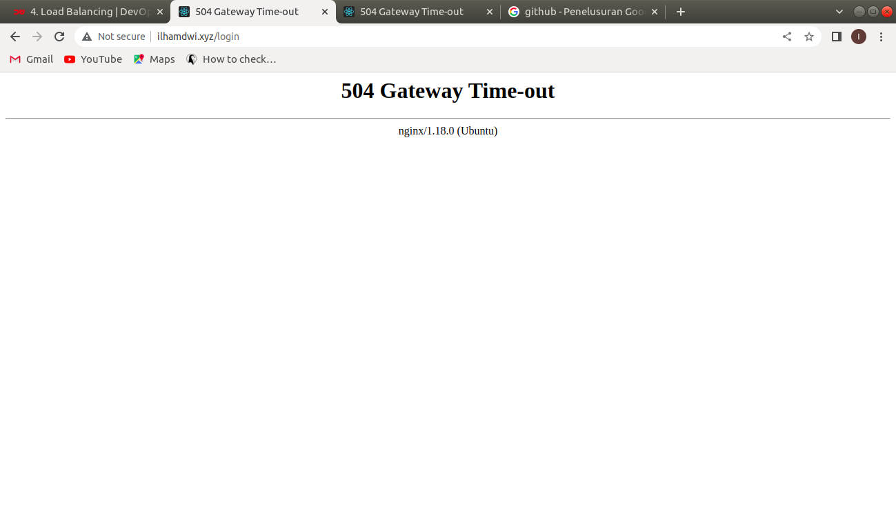


### - buat konfigurasi load balance antara VM1 dan VM2

* #### Untuk membuat load balance, edit file my.domain.conf.
``` 
upstream domain { 
    server (ip_server):3000;
    server (ip_nginx):3000;
}
server { 
    server_name ilhamdwi.xyz; 
  
    location / { 
             proxy_pass http://domain;
    }
}
```
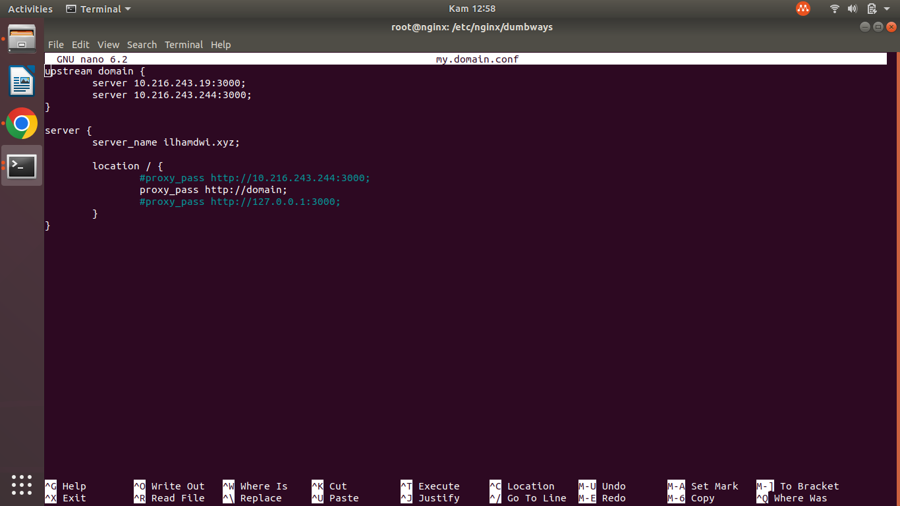

* #### Lalu coba akses aplikasi di web browser apakah berjalan lancar atau tidak.


* #### Coba matikan aplikasi wayshub di salah satu server.
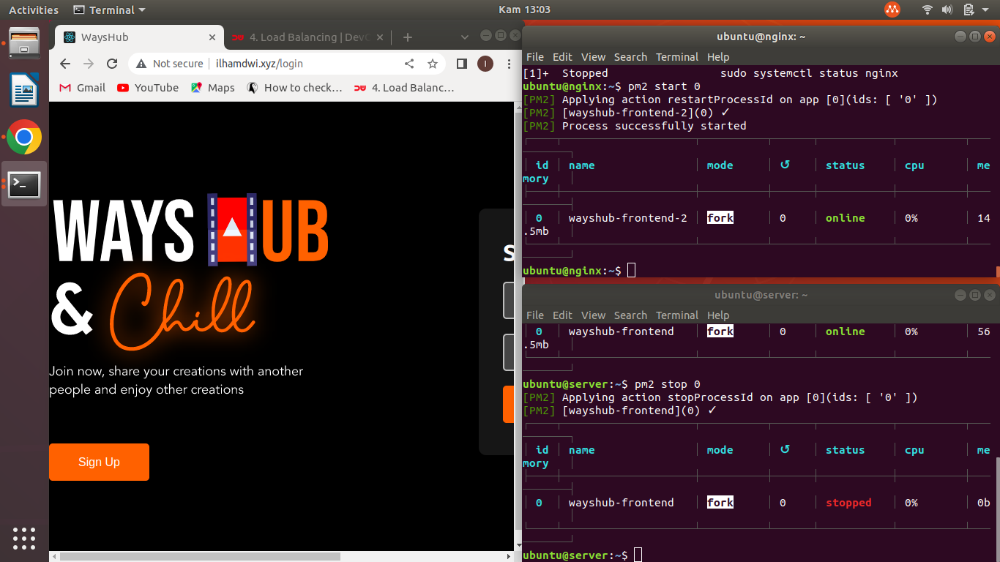

* #### Coba matikan aplikasi wayshub di semua server.
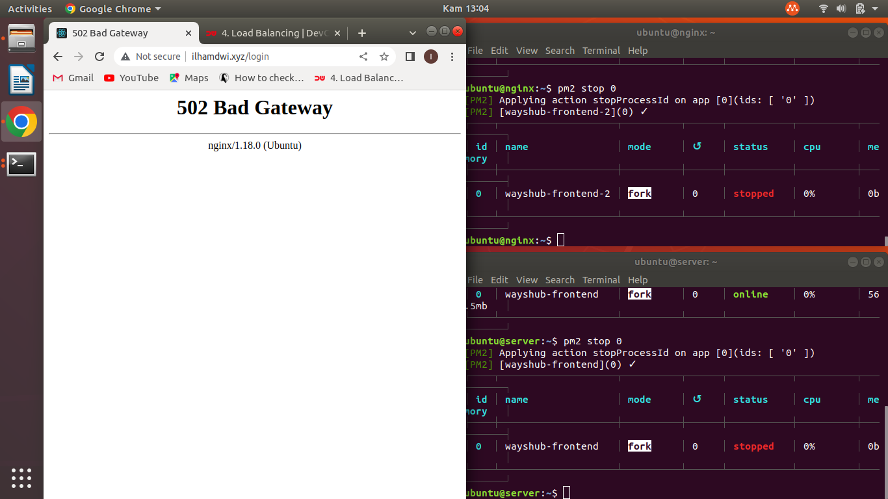

* #### Coba matikan aplikasi wayshub di salah satu server.
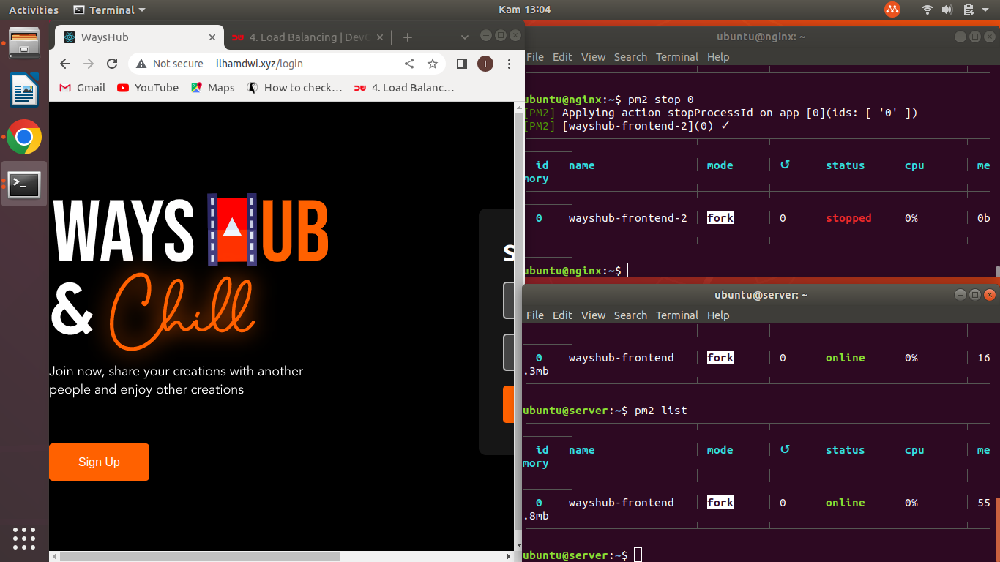

* #### Coba jalankan aplikasi wayshub di semua server.
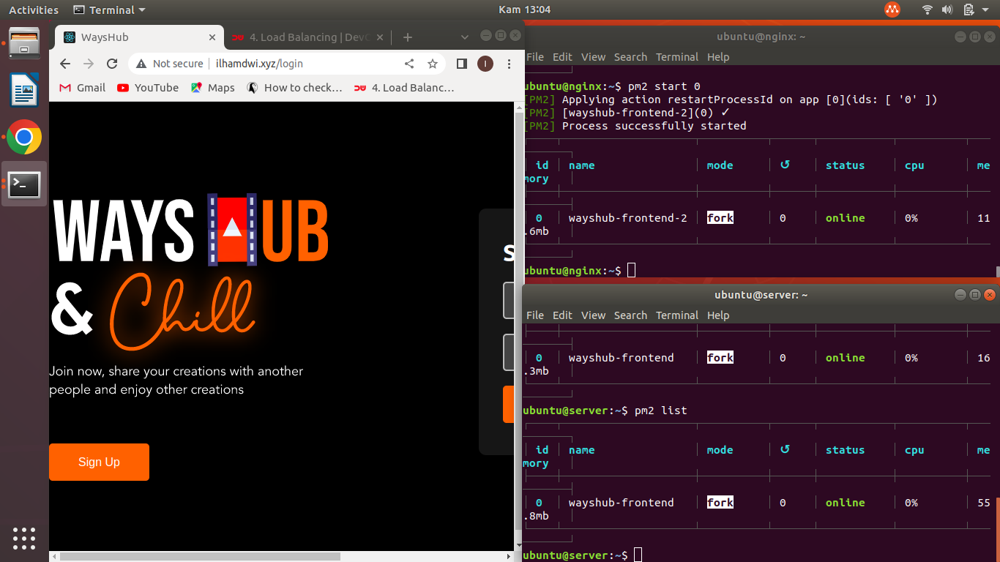


## 5. Domain bisa diakses melalui web browser kalian

* #### Coba jalankan aplikasi wayshub di semua server.
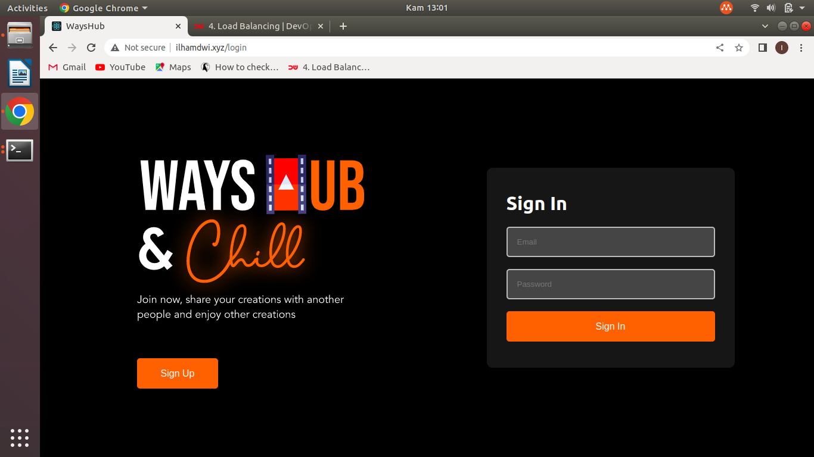


### Challenge
### Load Balancer berjalan dengan baik


