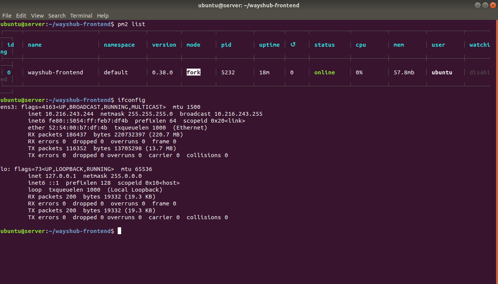

# Task : Web Server & Load Balancing

### 1. Definisi Web Server


### 2. Jalankan 2 VM
  #### - VM 1 = appserver
  #### - VM 2 = nginx


### 3. VM1 : jalankan aplikasi dumbflix-frontend - gunakan PM2

* #### Pertama jalankan aplikasi wayshub pada sisi server menggunakan pm2.
``` 
pm2 start npm --name "wayshub-frontend" -- start
```



### 4. VM2 :
  #### - jalankan nginx 
  #### - buat konfigurasi reverse proxy dengan domain (gunakan nama kalian) mengarah ke app di VM1
  #### - buat konfigurasi load balance antara VM1 dan VM2


### 5. Domain bisa diakses melalui web browser kalian

### Challenge
### Load Balancer berjalan dengan baik