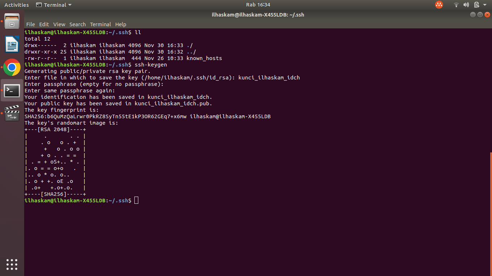
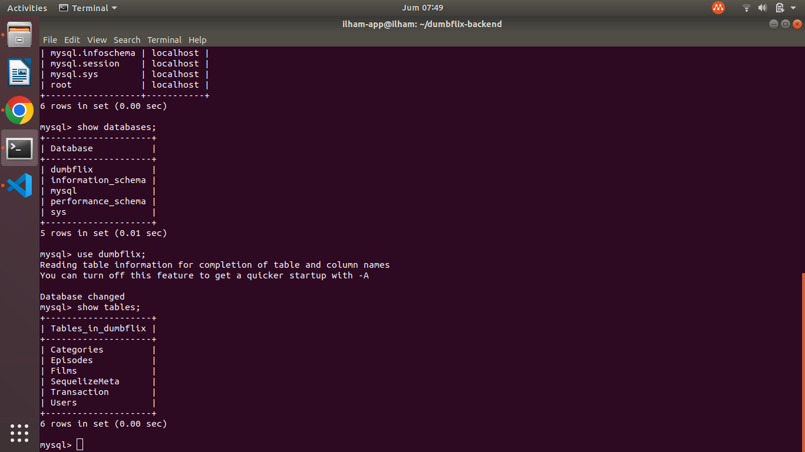

# Tugas Stage 2 Week 1

## appserver - 1 CPU, 2GB RAM & 20GB Storage


## gateway - 1 CPU, 1GB RAM & 20GB Storage


## 1. Koneksi SSH antara client/device kalian ke IDCH tanpa password

* #### Pertama lakukan command sebagai berikut untuk men-generate kunci beserta gembok diubuntu kita. Kunci dan gembok inilah yang akan menghubungkan ubuntu kita dengan server yang akan kita remote (ssh).
``` 
ssh-keygen
```


* #### Lalu cek apakah berhasil sudah berhasil dibuat didalam file .ssh .
``` 
cd .ssh

cat kunci_ilhaskam_idch.pub
```


* #### Gunakan perintah scp (secure copy) untuk mengcopy file dari ubuntu kita ke server tujuan kita. Dengan penambahan command -r (recursive) berarti kita mengcopy banyak file.
``` 
scp -r (nama_file_di_ubuntu_kita) username_server_tujuan@ip_server_tujuan:(direktori_tujuan)
```


* #### Lalu copy paste semua yang berada di kunci_ilhaskam_idch.pub ke dalam direktori .ssh/authorized_keys yang berada di server remote.
``` 
cat kunci_ilhaskam_idch.pub

cd .ssh

nano authorized_keys
```


* #### Lalu coba untuk remote server menggunakan command berikut. -i artinya inventory yang berarti kita mengakses inventori di dalam ubuntu kita.
``` 
ssh -i (file_kunci_disimpan) (username_tujuan)@(ip_tujuan)
```


## 2. Deploy Aplikasi Dumbflix menggunakan database MySQL

### - Database terhubung dengan Backend

* #### Pertama untuk menjalankan aplikasi backend setup terlebih dahulu databasenya. Install database mysql.
``` 
sudo apt install mysql-server
```


* #### Cek versi database mysql.
``` 
mysql --version
```


* #### Masuk ke user root database mysql.
``` 
sudo mysql -u (nama_user)
```


* #### Berikan password untuk user root.
``` 
ALTER USER 'nama_user'@'localhost' IDENTIFIED WITH mysql_native_password by 'password_baru';

atau bisa juga menggunakan command dibawah,keduanya sama saja.

ALTER USER 'nama_user'@'localhost' IDENTIFIED BY 'password_baru';
```


* #### Lalu amankan database mysql kalian menggunakan mysql_secure_installation. Lalu ikuti step by step berikut ini.
``` 
sudo mysql_secure_installation
```


* #### Masuk menggunakan root dengan -p yang atinya menggunakan password.
``` 
sudo mysql -u root -p
```


* #### Create user di dalam database mysql.
``` 
CREATE USER 'nama_user'@'%' IDENTIFIED BY 'password_anda';
```


* #### Berikan akses user ilham untuk mengakses seluruh database yang ada didalam mysql server.
``` 
GRANT ALL PRIVILEGES ON *.* TO 'nama_user'@'%';
```


* #### Clone aplikasi backend.
``` 
git clone https://github.com/dumbwaysdev/dumbflix-backend.git
```


* #### Configurasi file config/config.json ubah sesuai dengan user dan password yang sudah kita buat tadi.


* #### Install sequelize cli dan copy .env.example ke .env.
```
npm install -g sequelize cli

cp .env-copy .env
```


* #### Dikarenakan saya sudah copy file .env nya maka hasilnya seperti ini.


* #### Dengan sequelize kita bisa langsung menggunakan perintah db create untuk membuat database. Kita juga bisa mengenerate table dari aplikasi backend dumbflix dengan perintah db:migrate. Dikarenakan dumbflix-backend menggunakan ORM sequelize, maka proses create database dan migrate bisa lebih cepat.
```
npx sequelize db:create

npx sequelize db:migrate
```

* #### Cek apakah database sudah terbuat.
```
show databases;
```


* #### Memilih database dumbflix.
```
use dumbflix;
```


* #### Menampilkan table di dalam database dumbflix.
```
show tables;
```


* #### Menampilkan data dari table Users yang ada didalam database dumbflix.
```
SELECT * FROM Users;
```


### - Frontend dan Backend dapat diakses menggunakan domain nama.studentdumbways.my.id


## 3. Pastikan domain kalian bisa diakses menggunakan HTTPS

## Challenge
### - HTTPS menggunakan wildcard
### - Koneksi Reverse Proxy tidak menggunakan public IP

### Repository
### https://github.com/dumbwaysdev/dumbflix-frontend
### https://github.com/dumbwaysdev/dumbflix-backend