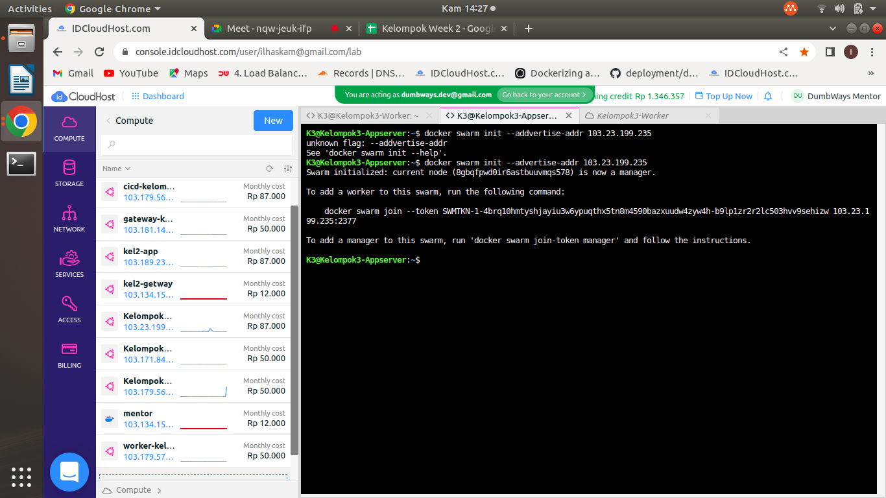
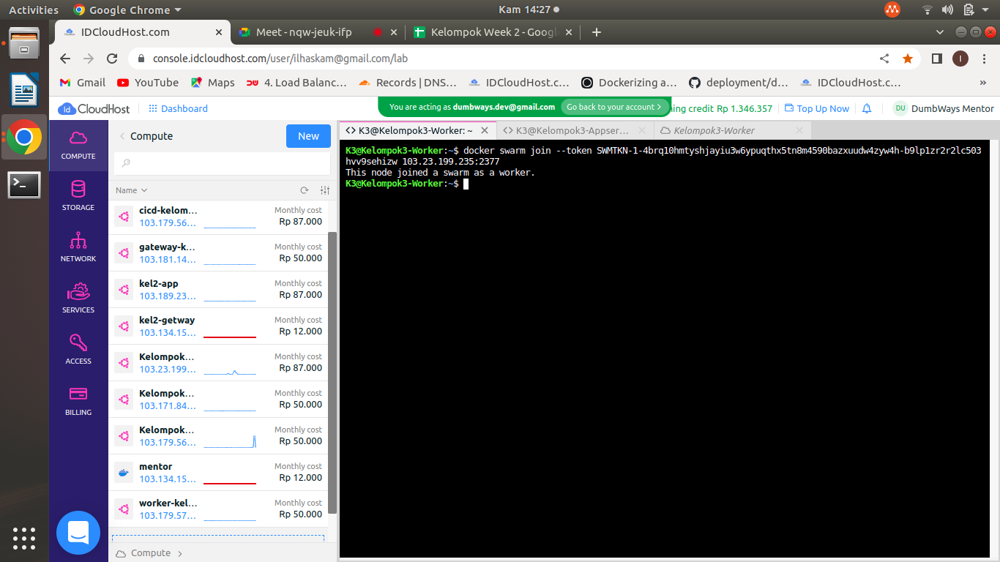

# Stage 2 Day 5 | Microservices : Docker Swarm

## "worker - 1 CPU, 1GB RAM, 20GB Storage

## 1. Deploy aplikasi frontend dalam Docker Swarm

## 2. Hubungkan worker dengan appserver
* #### 

## 3. Jalankan 2 replica untuk aplikasinya

## 4. Web dapat diakses melalui Docker Swarm

## Note :
### - Matikan service jika sudah didokumentasi
### - Praktekkan kembali pada saat presentasi"

		
		
		
		
		
		
		
		
		
		
		
		
		
		
		
		
		