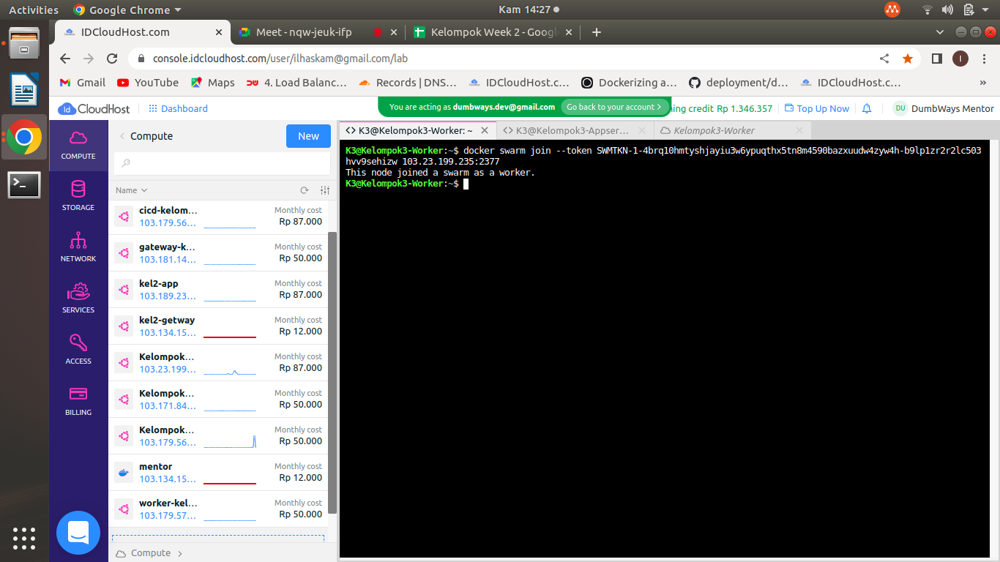

# Stage 2 Day 5 | Microservices : Docker Swarm

## "worker - 1 CPU, 1GB RAM, 20GB Storage

## 1. Deploy aplikasi frontend dalam Docker Swarm


## 2. Hubungkan worker dengan appserver

* #### Menghubungkan vm Apserver dengan vm worker.
```
docker swarm init --advertise-addr (ip_appserver)
``` 


* #### Copy paste tulisan docker swarm join yang muncul pada ssat docker swarm init di dalam vm worker.
```
docker swarm join --token .......
``` 


* #### Pada vm appserver coba cek apakah vm worker sudah terhubung sebagai worker.
```
docker node ls
``` 


## 3. Jalankan 2 replica untuk aplikasinya

* #### Untuk menjalankan Replica ketikkan perintah seperti dibawah. 2 adalah jumlah replica.
```
docker service scale (nama_service)=2
``` 


## 4. Web dapat diakses melalui Docker Swarm

* #### Untuk capture saat mengakses aplikasi kita lupa untuk mencapturenya, jadi untuk capture aplikasi mungkin hanya ini yang bisa ditampilkan, namun dari kelompok kami aplikasi sudah bisa diakses dan dijalankan menggunakan ip server dan ip worker.


## Note :
### - Matikan service jika sudah didokumentasi
### - Praktekkan kembali pada saat presentasi"

		
		
		
		
		
		
		
		
		
		
		
		
		
		
		
		
		
