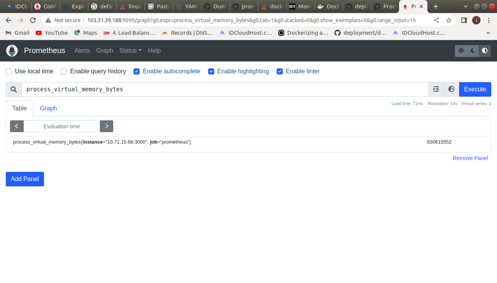
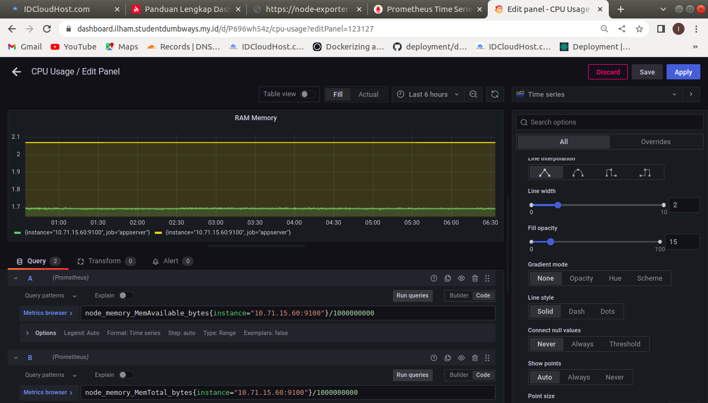

# Task Monitoring Server

## monitoring - 1 CPU, 2GB RAM, 20GB Storage


## 1. Deploy node exporter, prometheus & grafana on top docker

* #### Buat docker.compose.yml untuk menjalankan aplikasi node-exporter, prometheus, dan grafana.


* #### Up docker compose.
```
docker compose up -d
```

* #### Lalu cek apakah aplikasi sudah berjalan di docker container
```
docker ps -a
```


### - Tambahkan file prometheus.yml

* #### Buat file config, lalu di dalam direktori config buat file prometheus.yml.
```
mkdir config

touch prometheus.yml
```


### -  Arahkan ke localhost kalian

* #### Di dalam file prometheus.yml berisi konfigurasi untuk menentukan ip dari target yang ingin di ambil data metricsnya.


## 2. Buat dashboard untuk monitoring CPU & RAM

* #### Untuk membuat dashboard di grafana, pastikan dulu bahwa aplikasi node-exporter dan prometheus sudah berjalan. Dikarenakan prometheus mengambil nilai metrics dari aplikasi node-exporter, sedangkan grafana akan menampilkan dashboard bila sudah terhugung dengan aplikasi prometheus.

* #### Ini adalah tampilan dari node-exporter.


* #### Lalu ini adalah tampilan dari prometheus.




* #### Jika tulisan up berarti konfigurasi yang kalian tambahkan di dalam file prometheus.yml sudah benar, jika ada tulisan down berarti pada sisi target aplikasi node-exporter belum dijalankan.

* #### Lalu ini adalah tampilan dari grafana.


* #### Untuk mengambil nilai dari prometheus, pada grafana tambahkan data source, lalu pilih prometheus.


* #### Untuk menambahkan dashboard, klik dashboard lalu klik new.

* #### Ini adalah rumus perhitungan untuk CPU Usage.


* #### Sedangkan ini untuk perhitungan RAM Memory available dan total keseluruhan memory.


* #### Sedangkan ini untuk melihat network receive (menerima) dan network transmit (pengiriman) data.


* #### Ini adalah tampilan dashboard yang sudah dibuat.


## 3. Reverse proxy dan SSL :

### - node-exporter.ilham.studentdumbways.my.id


### - prom.ilham.studentdumbways.my.id


### - dashboard.ilham.studentdumbways.my.id


* #### Untuk petunjuk pembuatan SSL certificate dengan wildcard bisa di lihat di dalam folder dns_ssl_wildcard.

## Challenge
### - Push notification grafana