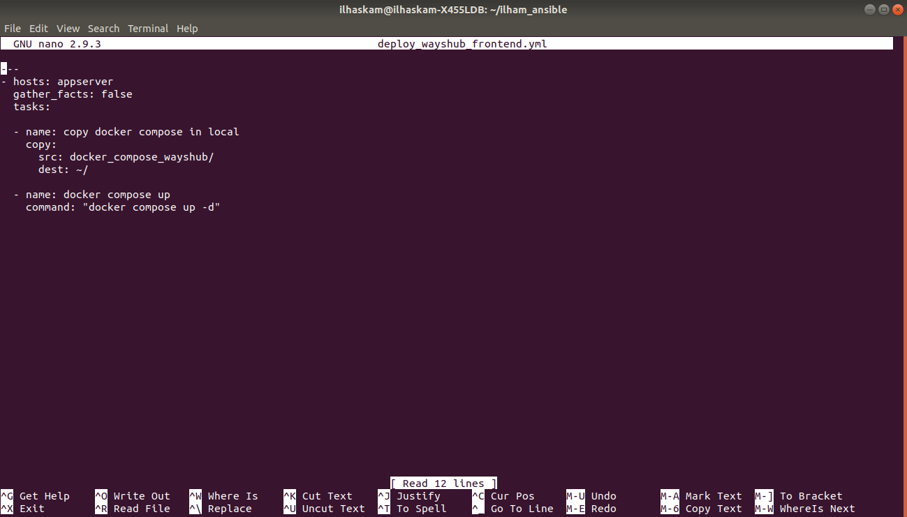
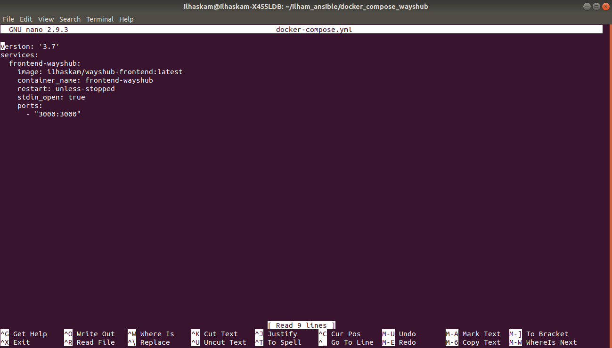
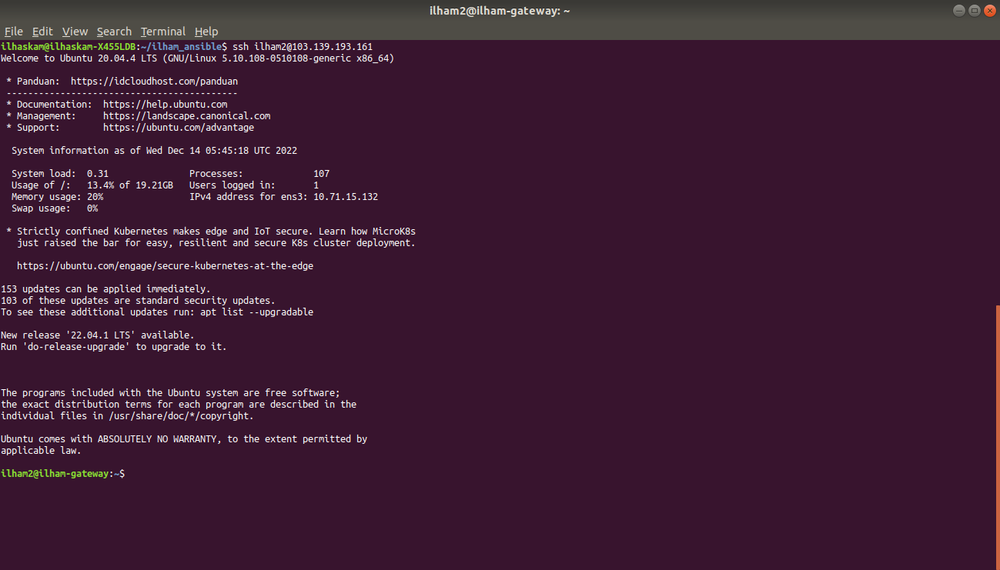
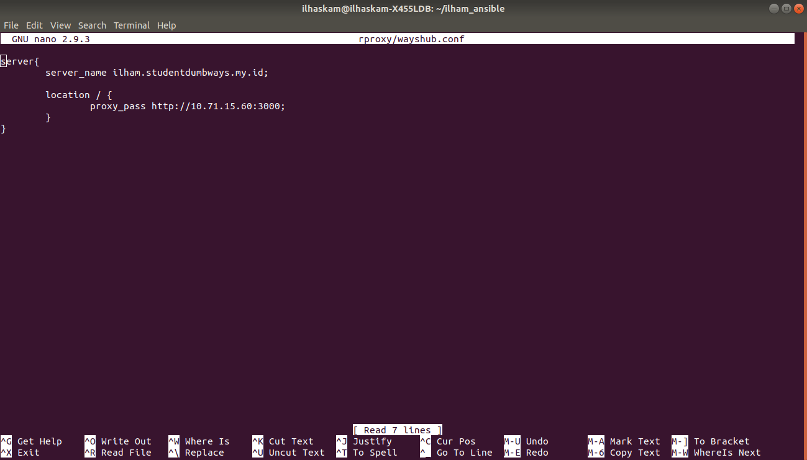

# Task Ansible

## appserver - 1 CPU, 2GB RAM
## 20GB Storage


## gateway - 1 CPU, 1GB RAM
## 20GB Storage


## 1. [Local] buat konfigurasi Ansible & dan lakukan semua setup melalui local sebanyak mungkin


## 2. [appserver] gunakan ansible-playbook

### - Membuat user baru, gunakan login ssh key

* #### Buat ansible-playbook bernama create_user_and_deploy_ssh_key.yml. Disini saya membuat user baru bernama "ilham" pada sisi appserver.


* #### Buat file Inventory.


* #### Buat file ansible.cfg.


* #### Cek sintax dari ansible-playbook. Lalu jalankan ansible-playbook.
```
ansible-playbook nama_file --syntax-check

lalu

ansible-playbook nama_file
```


* #### Lalu cek pada sisi appserver apakah user ilham sudah terbuat. Dan cek juga pada folder .ssh/authorized_key apakah sudah ditambahkan kunci publik dari server yang telah me-remote server appserver.


* #### Lalu coba untuk ssh ke dalam user yang telah kita buat di dalam server appserver. Dan pastikan kita tidak perlu memasukkan password untuk login sshnya.


### - Instalasi Docker & node-exporter

### Install Docker
* #### Pertama tambahkan plugin di dalam server local kita.


* #### Lalu buat file docker.yml di dalam server local kita.


* #### Lalu cek sintax ansible-playbook dan jalankan ansible-playbook.


* #### Lalu cek pada sisi server appserver apakah docker sudah terinstall.


### Install Node Exporter

* #### Buat file install_node_exporter.yml di dalam server local kita.


* #### Lalu cek sintax ansible-playbook dan jalankan ansible-playbook.


* #### Lalu cek pada sisi server appserver apakah node-exporter sudah terdeploy dan berjalan.
```
docker ps -a
```


* #### Lalu akses pada web menggunakan ip publik dari server appserver lalu tambahkan port yang berjalam di node-exporter.


### - Gunakan docker-compose untuk deploy aplikasi wayshub-frontend

* #### Buat list directory seperti ini.


* #### Isi dari file deploy_wayshub_frontend.yml.


* #### Isi dari file docker-compose.yml.


* #### Cek sintax dan jalankan ansible-playbook.


* #### Cek wayshub di web browser.


## 3. [gateway] gunakan ansible-playbook

### - Membuat user baru, gunakan login ssh key

* #### Buat ansible-playbook bernama create_user_and_deploy_ssh_key.yml. Disini saya membuat user baru bernama "ilham2" pada sisi gateway.


* #### Buat file Inventory.


* #### Buat file ansible.cfg.


* #### Cek sintax dari ansible-playbook. Lalu jalankan ansible-playbook.
```
ansible-playbook nama_file --syntax-check

lalu

ansible-playbook nama_file
```


* #### Lalu cek pada sisi gateway apakah user ilham2 sudah terbuat. Dan cek juga pada folder .ssh/authorized_key apakah sudah ditambahkan kunci publik dari server yang telah me-remote server gateway.


* #### Lalu coba untuk ssh ke dalam user yang telah kita buat di dalam server appserver. Dan pastikan kita tidak perlu memasukkan password untuk login sshnya.



### - Instalasi nginx


### - Buat konfigurasi proxy lalu masukkan kedalam gateway





## 4. [monitoring] buat konfigurasi prometheus

### - monitor CPU & RAM untuk appserver

* #### Tambahkan IP target yang ingin di monitoring.


### - monitor network untuk appserver


### - monitor network untuk gateway


## Challenge

## - SSL Certificate menggunakan ansible

## - Mengirimkan public key ke semua server (Note: untuk setup awal)

* #### Buat file add_public_key.yml.


* #### Buat file Inventory.


* #### Buat file ansible.cfg.


* #### Cek authorized_keys dan belum ada isinya.


* #### Pada saat menjalankan ansible-playbook disini saya menambahkan --ask-pass dikarenakan pada file add_public_key.yml saya belum menambahkan variabel password dari server yang mau di remote. variabel --ask-pass akan meminta password saat akan menjalankan ansible-playbook.


* #### Lalu cek lagi authorized_keys yang ada pada server yang sudah di remote tadi. Maka authorized_keys secara otomatis ditambahkan.


* #### Lalu coba ssh ke dalam server, maka tidak memerlukan password dikarenakan kita sudah menambahkan public_key lewat ansible_playbook.
