# Task Microservices : Kubernetes

## leader - 2 CPU, 2GB RAM, 20GB Storage

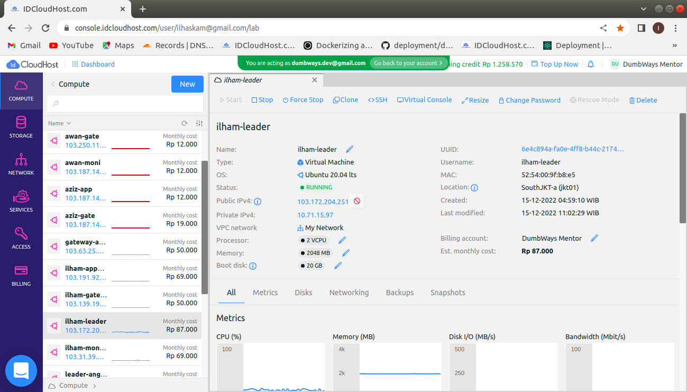


## 1. Deploy minikube dengan 2 node (1 control-plane, 1 worker)

* #### Pertama install minikube dan kubectl.
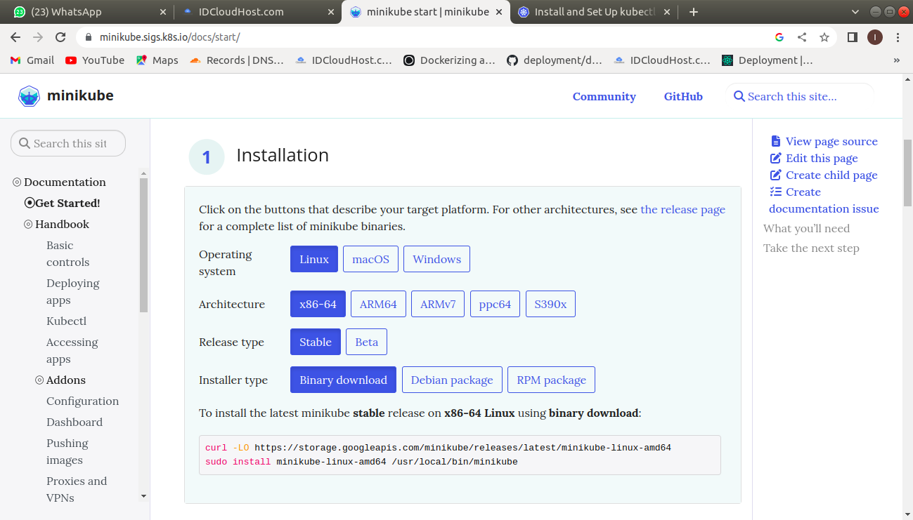

* #### Disini ada error driver tidak terdeteksi. Sebelum menginstall minikube pastikan kalian sudah menginstall docker di dalam servernya, karena minikube membutuhkan docker untuk dijalankan sebagai driver.
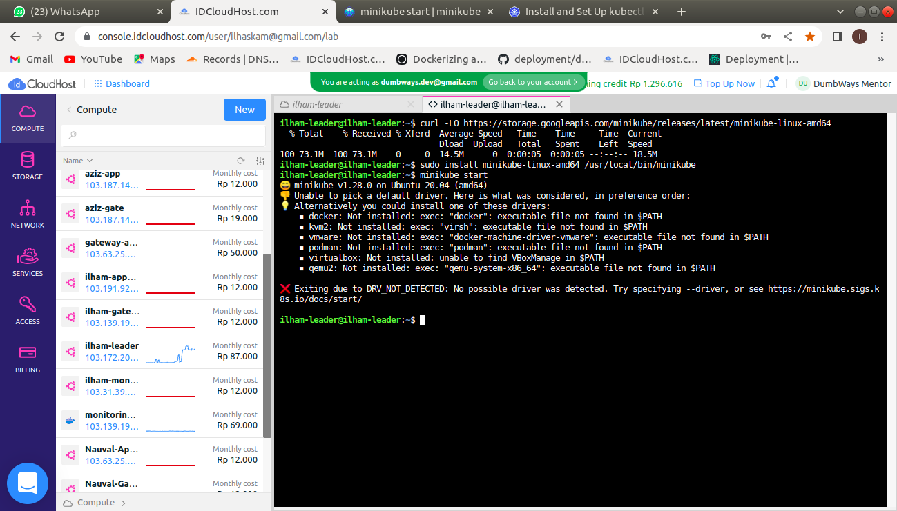

* #### Setelah diinstall docker baru bisa menjalankan minikube start.
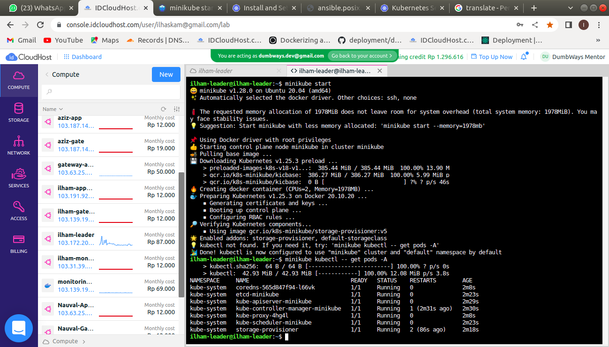

* #### Install kubectl. Disini saya menginstall kubectl menggunakan ansible-playbook.
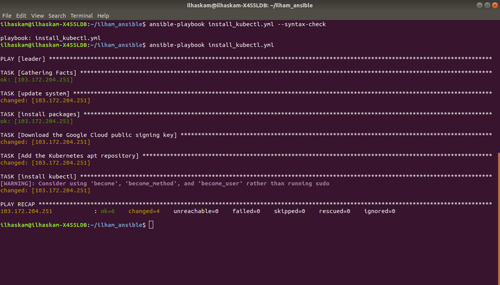
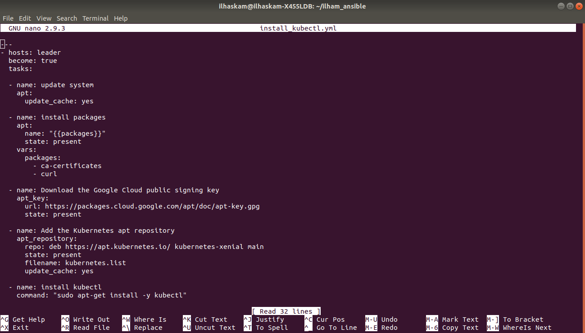
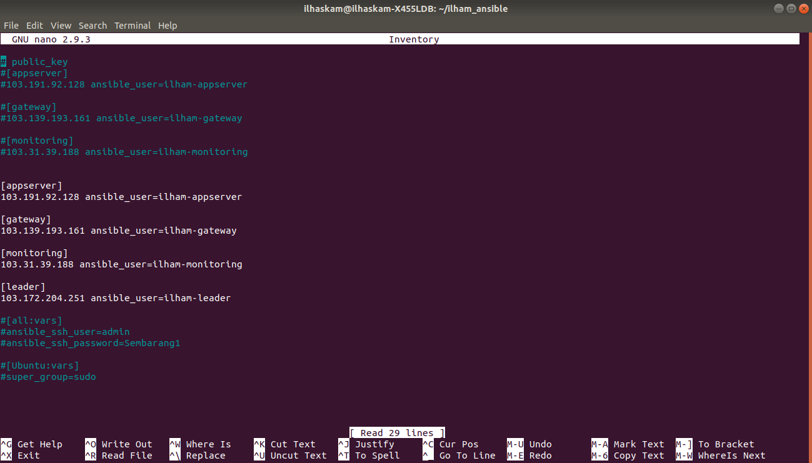
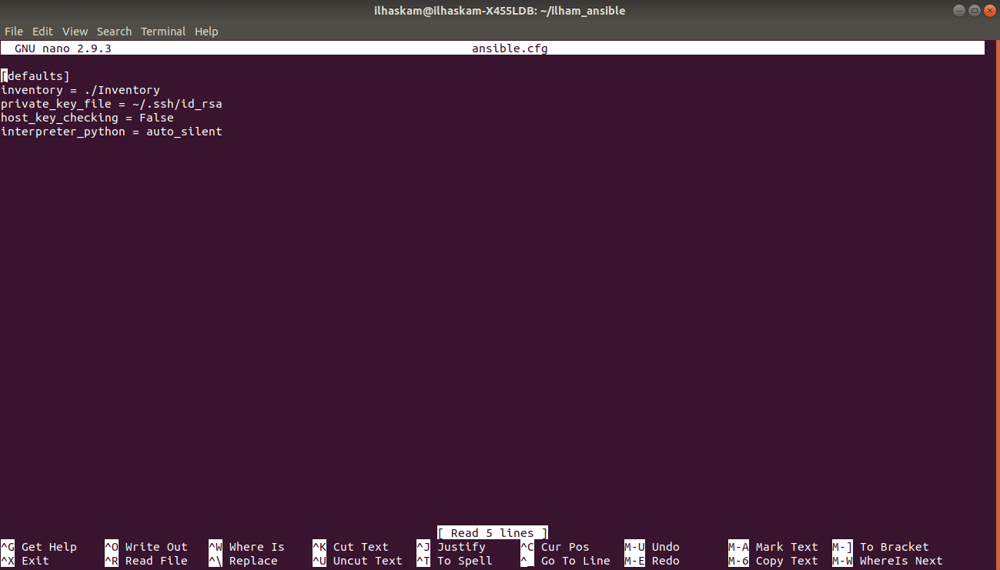

* #### Selanjutnya cek bahwa kubectl sudah terinstall.
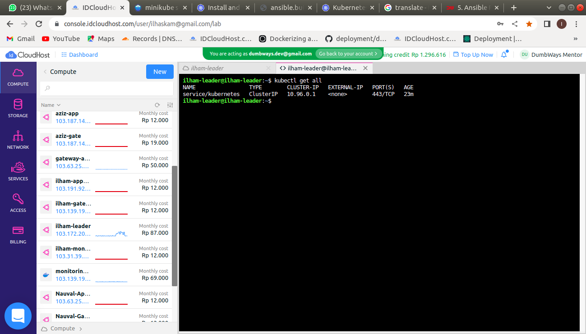

### Catatan : karena saya disini ingin menjalankan multi-node didalam minikube maka ikuti langkah-langkah berikut.

* #### Jalankan perintah berikut untuk menjalankan 2 node di dalam minikube. Node 1 sebagai control-paneldan node 2 sebagai worker.
```
minikube start --nodes 2 -p multinode-ilham
```
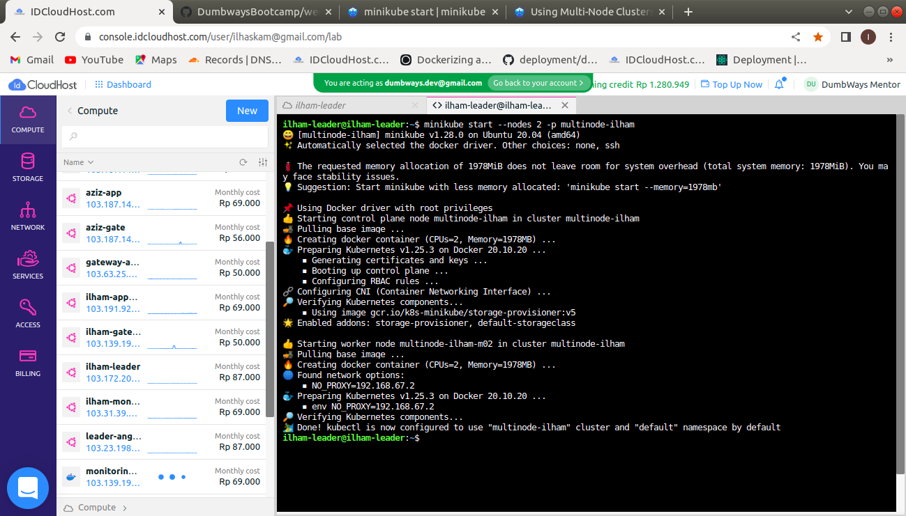

* #### Lalu cek.
```
kubectl get all

kubectl get nodes
```
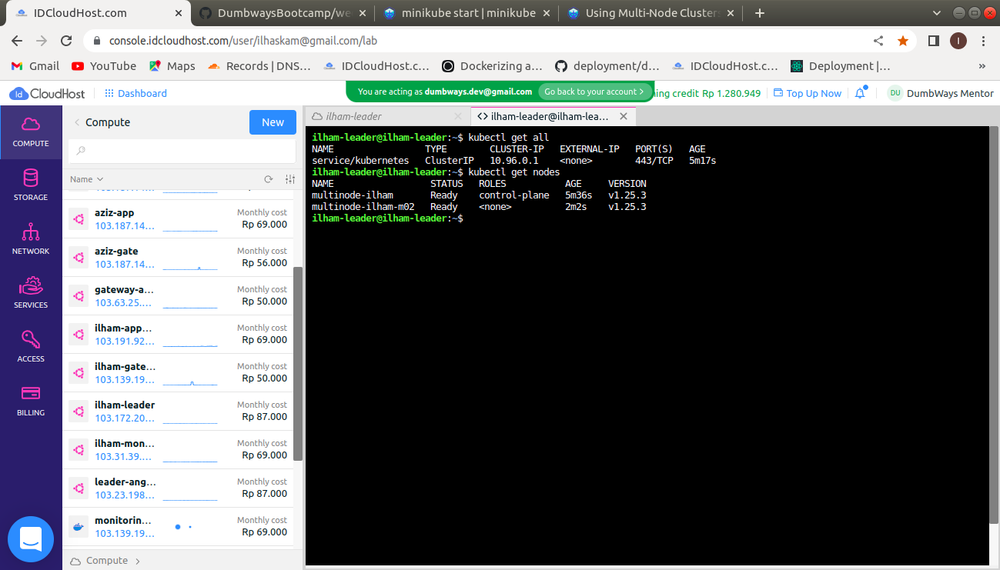


## 2. Deploy image nginx lalu expose menggunakan NodePort

* #### Create deployment nginx lalu expose portnya.
```
kubectl create deployment nginx --image=nginx
kubectl expose deployment nginx --type=NodePort --port=80
```
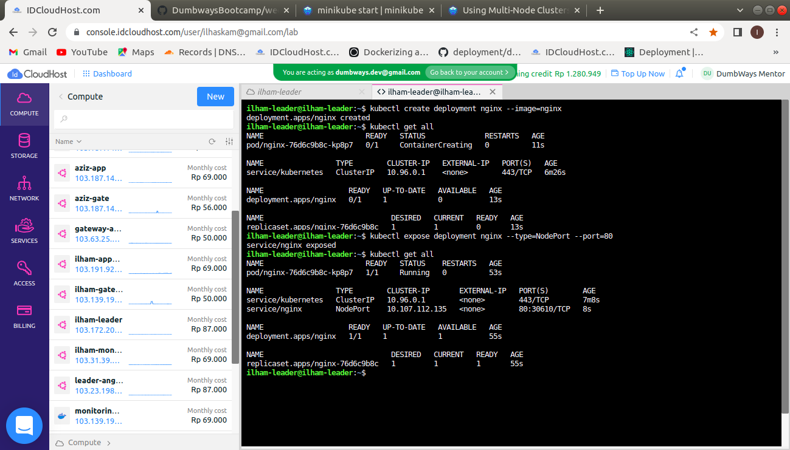

* #### Untuk bisa diakses melalui localhost jalankan perintah berikut.
```
kubectl port-forward service/nginx 3001:80
```
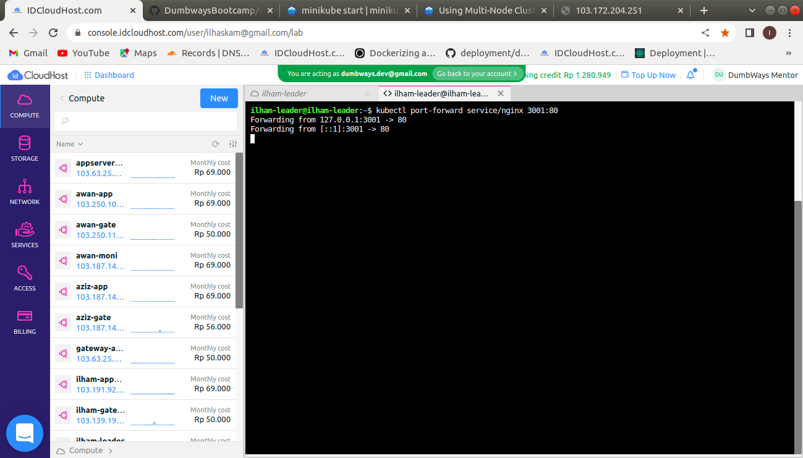


## 3. nginx bisa diakses langsung

* #### Untuk mengecek apakah sudah berhasil. Di server local kalian ssh ke dalam server yang menjalankan minikube. Lalu cek menggunakan curl apakah nginx sudah berjalan di port yang 3001, jika muncul script seperti gambar di bawah ini berarti nginx sudah berhasil dijalankan di localhost server menggunakan minikube.
```
curl 12.0.0.1:3001
```
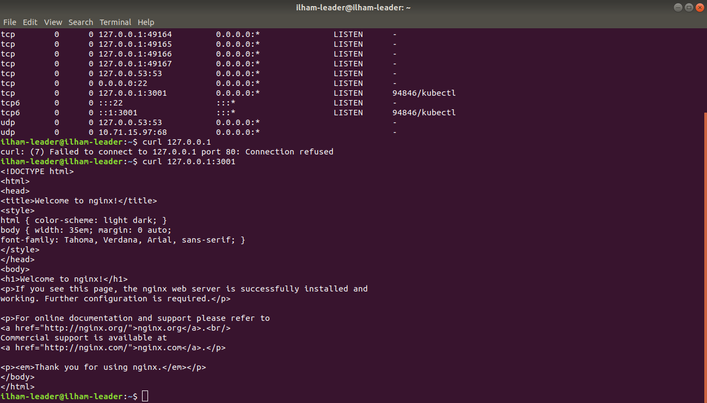


## Challenge

### - no 2 diganti deploy mongoDB lalu ping database sampai berhasil

* #### Untuk deploy mongodb di minikube sama seperti deploy nginx. Disini saya menggunakan image dari bitnami-mongodb.
```
kubectl create deployment mongodb --image=bitnami-mongodb
kubectl expose deployment mongodb --type=NodePort --port=27017
```
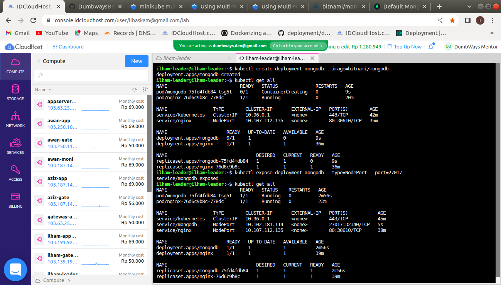

* #### Port 27017 adalah default port dari mongodb, sedangkan 27200 adalah kita ingin menjalankan mongodb di server kita dengan port 27200.
```
kubectl port-forward service/[nama_service] 27200:27017
```
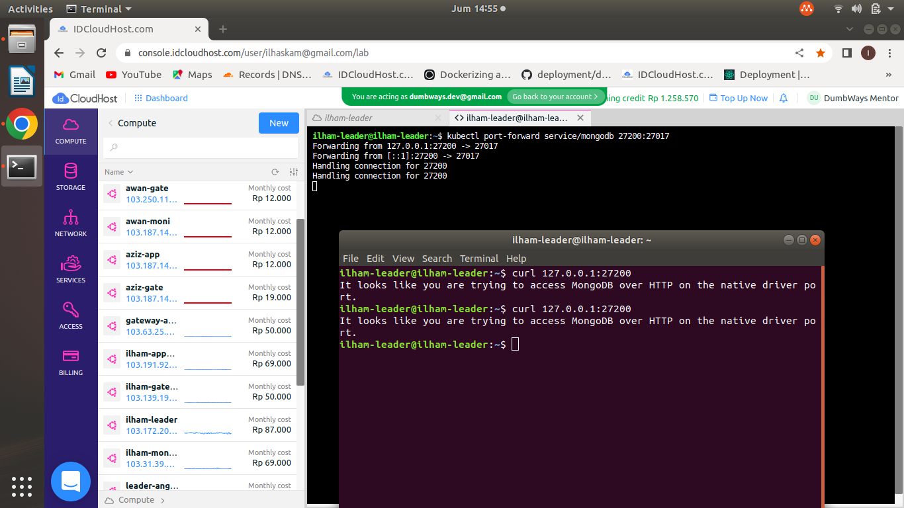


### - gunakan ingress & replicaset